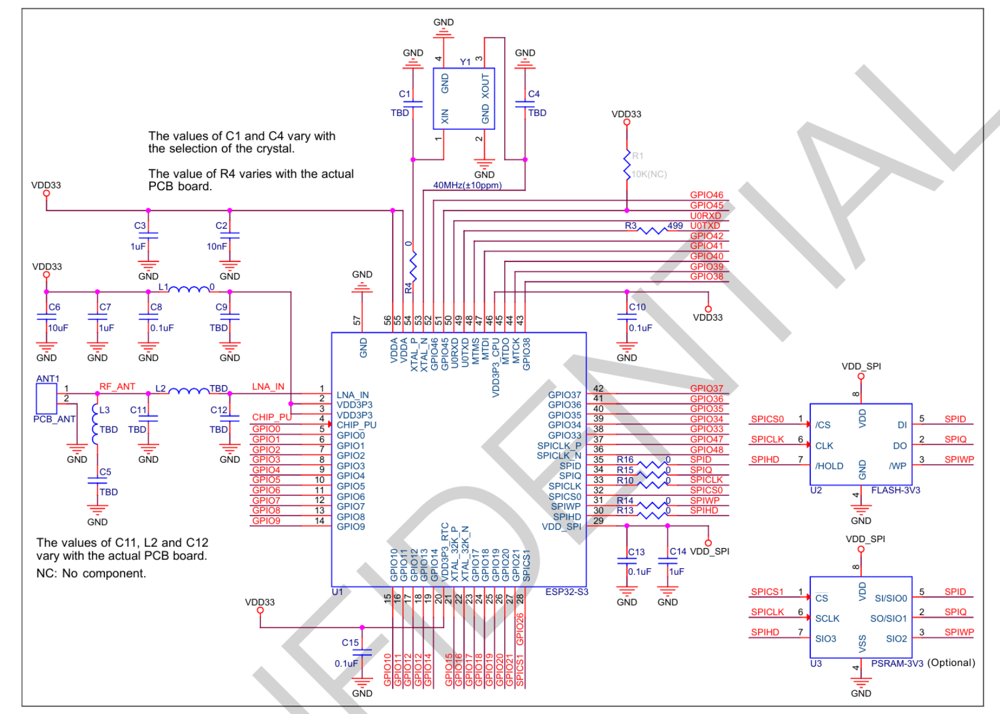
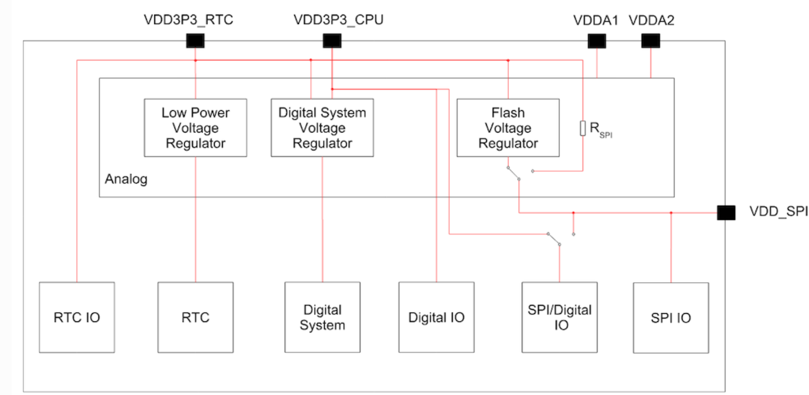

## S3电源

| 电源域     | 主要供电对象                           | WiFi工作时电流量级  | WiFi发射瞬态影响       | 可信度 |
| ---------- | -------------------------------------- | ------------------- | ---------------------- | ------ |
| VDD3P3     | 数字核心、WiFi基带、MAC、DMA、数字逻辑 | **100~300mA级**     | 最大，可能增加数百mA   | 高     |
| VDD3P3_CPU | CPU核心相关数字电路                    | **几十mA级**        | 有增加                 | 中     |
| VDD_SPI    | Flash/PSRAM接口                        | **几mA~几十mA级**   | 取决于访问量           | 中     |
| VDDA       | RF模拟、PLL、模拟模块                  | **几mA级~十几mA级** | 有变化，但不是主要来源 | 中     |
| VDD3P3_RTC | RTC、低功耗域                          | **mA级或更低**      | 基本不变               | 高     |

