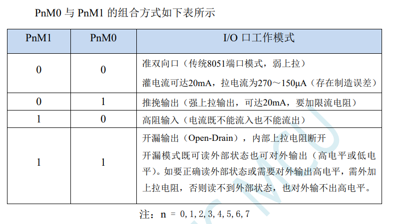
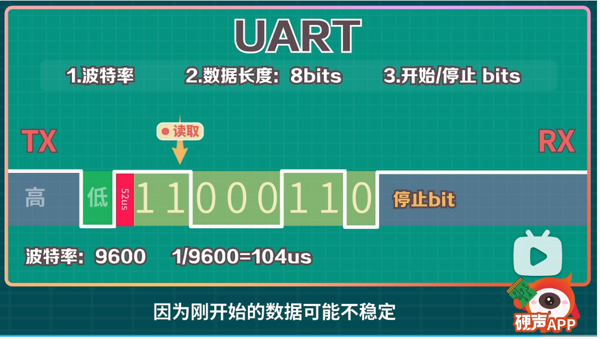
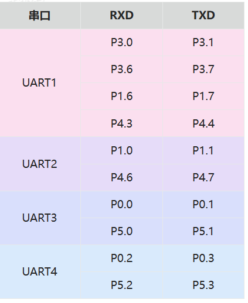

## IO引脚

### IO口的工作模式

>
>
>如上图，IO口共有4种工作模式
>
>
>
>一组引脚使用两个特殊寄存器控制工作模式
>
>P5M0 = 0xXX;	XX是具体地址，具体地址在单片机的技术手册里面找
>
>P5M1 = 0xXX;
>
>例如配置P53的工作模式为，推挽输出
>
>P5M0 |= 0X08;
>
>P5M1 &= ~0X08;

### 寄存器配置IO口代码

~~~C
/*
	寄存器操作
*/

// 通过文档获取 操作引脚工作模式的地址
sfr P5M0  =0xCA;
sfr P5M1 =0xC9;

sfr P2M0 =0x96;
sfr P2M1 =0x95;

sfr P4M0 =0xb4;
sfr P4M1 =0xb3;

// 通过引脚工作模式地址获取，单个引脚的地址
sfr P5 = 0xc8;
sbit P53 = P5^3;

sfr P2 =  0xa0;
sbit P26 =0xa0^6;
sbit P27 = P2 ^ 7;
sbit P21 = P2 ^ 1;
sbit P22 = P2 ^ 2;
sbit P23 = P2 ^ 3;

sfr P4 =  0xc0;
sbit P45 = P4 ^ 5;

int main() {

    // 配置引脚工作模式
    P5M0 |= 0x08;
    P5M1 &= ~0x08;
    P2M0 |= 0x80+0x40+0x02+0x04+0x08;
    P2M1 &= ~(0x80+0x40+0x02+0x04+0x08);
    P4M0 &= ~0x20;
    P4M1 &= ~0x20;

    // 单个引脚控制高低电平
    P45 = 0;
    P26 = 1;
    P27 = 1;
    P21 = 0;
    P53 = 1;
}

~~~

## UART

### 说明

uart通信，通过两颗线RX和TX和进行通信。也许还需要一颗GND，作为参考信号。

### 通信过程

当高电平突然转低时,表示开始发送数据，发送完毕时电平转高

### 参数

#### 波特率

9600表示每秒发送9600个bit

115200表示每秒发送115200个bit

### STC8H8K64U的uart引脚

