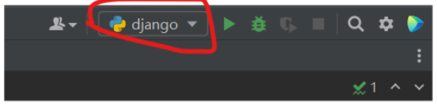
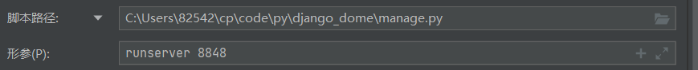
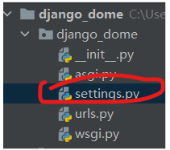
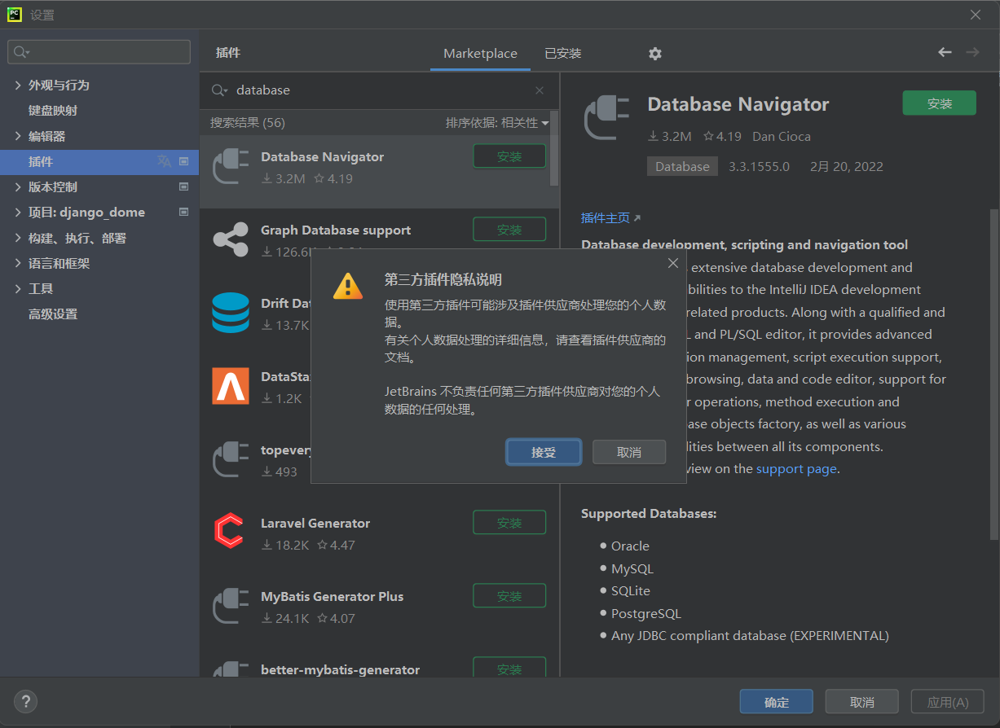
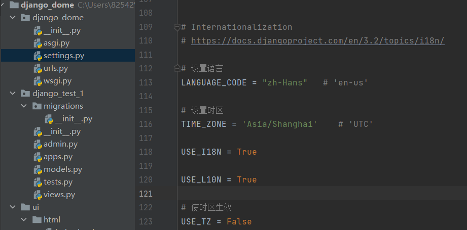
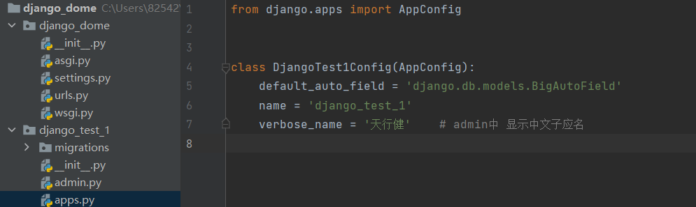
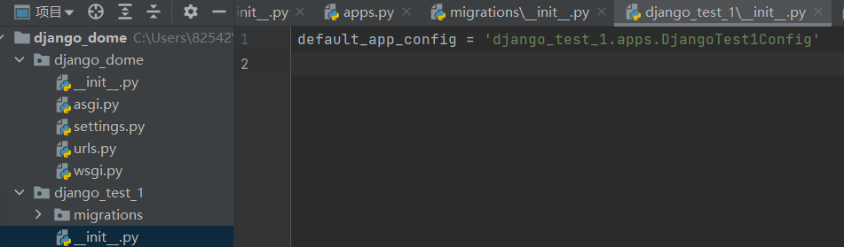
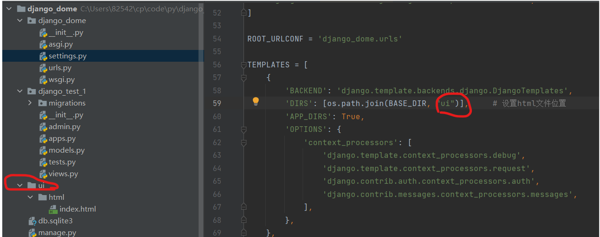
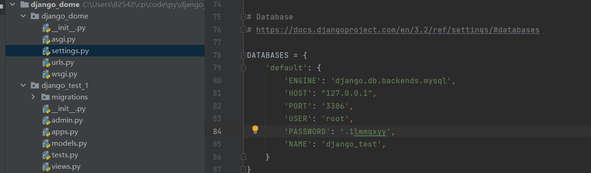

## 基础

### 下标

整数从0开始，代表第一个数据

负数从-1开始，代表最后一个数据

### 系统类型

#### 列表

~~~python
# 列表使用中括号包裹
[]

# 列表中可以保存任意类型的数据
["a",1,[2,2]]

# 追加元素
append(data)
	# data: 需要追加的元素
    # 返回值：None

# 将可迭代对象拆分后追加
extend(data)
	# data: 可迭代对象
    # 返回值: None
    
# 查找元素
index(sub_str,start,end)   
	# sub_str: 子串
    # start: 开始位置(默认0)
    # end: 结束位置(默认len())
    # 返回值：存在返回下标，不错在抛出错误
    
# 判断元素是否存在
"a" in ["a","b","c"] # 存在返回True

# 统计元素出现次数
count(data)
	# data: 需要统计的元素
    # 返回值: 元素出现的次数

# 删除指定下标的元素
pop(index)
	# pop: 元素的下标,默认删除最后一个
    # 返回值: 删除的元素，下标不存在抛出错误
    
# 删除指定值的元素
remove(value)
	# value: 元素的值
    # 返回值: None,值不存在抛出错误
    
# 排序
[1,9,4].sort() # 返回None，如果数据类型不一致抛出错误
[1,9,4].sort(reverse=Ture) # 倒序

# 倒置
[1,9,4].reveres()
~~~

#### 元组

~~~python
# 元组使用小括号包裹，只能查询和切片
()
~~~

#### 字典

~~~python
# 字典使用花括号包裹,字典的key可以是字符串和数据，value可以是任意类型
{}

# 通过key获取value
get(key)
	# key: key值
	# 返回值: 存在返回value,不错在返回None
    
# 添加数据,python3中的字典是根据添加数据的顺序排序，有序的
{}[key] = value # 如果不存在添加，如果存在修改

# 通过key删除数据
pop(key)
	# key值
    # 返回值: 存在返回value,不存在抛出错误
 
# 通过key值创建列表
list({}.keys())

~~~

#### 字符串

~~~python
# 查找子串
find(sub_str,start,end)
	# sub_str: 子串
    # start: 开始位置(默认0)
    # end: 结束位置(默认len())
    # 返回值：存在返回下标，不存在返回 -1
    # rfind: 从末尾查找
    # index: 没有找到会报错
    # rindex: 从末尾查找,没有找到会报错
    
    
# 统计子串出现的次数
count(sub_str,start,end)
	# sub_str: 子串
    # start: 开始位置(默认0)
    # end: 结束位置(默认len())
    # 返回值：子串出现的次数
    
# 替换子串
replace(old_str,new_str,count)
	# old_str: 老的子串
    # new_str: 新的子串
    # count: 替换次数（默认替换全部）
    # 返回值：返回一个新的字符串，不会改变原来的字符串（如果没有发生替换则返回老字符串的地址）
    
# 分割字符串
split(sub_str,count)
	# sub_str: 分割符，按照什么分割
    # count: 分割次数
    # 返回：分割好的列表,分隔符不存在

# 添加分隔符
join(data)
	# data: 需要添加分隔符的字符串
    # 返回值: 添加分隔符后的的字符串
    # 例："_".join("aaa")  # 返回: "a_a_a" 
~~~

### 函数

#### 函数文档注释

~~~python
# 查看函数的文档注释
help(函数名)

# 书写函数的文档注释
def test():
    '''
    这是文档注释
    这是文档注释
    '''
    pass
~~~

#### 函数内部使用全局变量

~~~python
n = 0

def test():
    global n # 需要声明 n 为全局变量然后才可以使用
    n = 100
    
~~~

#### 闭包

~~~python
# 类似过去使用回调函数时喜欢预留的空指针，使用闭包可以给回调函数添加参数
def func_in(a):
    def func_out():
        print(a)
    return func_out	# 返回内部函数
~~~

#### 装饰器

~~~python
# 装饰器，在不改变函数的情况下给函数添加功能

# 添加功能
def func_a(func):
    def func_b(test):
        ret = func(test)
        print("功能2")
        return ret
    return func_b

@func_a # 装饰器语法，相当于下面的写法
# 原来的函数
def func_c(test):
    print("功能1")
    print(test)
    return test+"成功"
# func_c = func_a(func_c) # 相当于这样写

print(func_c("测试"))
~~~

### 面向对象

#### 类的语法

~~~python
# 类的实现
class b(object):
    pass

# 对象的创建
my_b = b()

~~~

#### 魔法方法

> 魔法方法会在满足特定条件下自动调用

##### init

- 对象创建时自动调用，构造函数

##### del

- 对象销毁时自动调用，析构函数

##### str

- 函数必须返回一个字符串对象
- 使用print()和str()方法时，自动调用

- 用于返回对象的描述

#### 私有属性和方法

- 使用 **__** 为前缀，即为私有属性和方法
- 实际上只是改了个名字，加上 **_类名** 即可访问

#### 类属性和方法

- 属性，在类内部函数外部定义的属性。只有一份，使用 **类名.** 调用
- 方法，使用 **@classmethod** 装饰。只有一份，使用 **类名.** 调用
- 静态方法，使用 **@staticmethod** 装饰。只有一份，使用 **类名.** 调用

#### 继承

- 可以继承父类的 公开**属性**和**方法**
- 重写，方法名称和父类系统。**super().方法(参数)** 调用父类被覆盖的方法

#### 多态

- 在需要父类对象时可以传入子类对象
- 子类基础父类
- 子类重写父类方法
- 定义共同的方法，调用子类和父类的同名方法

### 异常

#### 异常捕获

~~~python
# 捕获单个异常
try:
   # 需要捕获异常的代码
except 指定的异常1 :
    # 出现指定的异常1时执行的代码
except 指定的异常2 :
    # 出现指定的异常2时执行的代码
...
#########################################################################################

# 捕获多个异常
try:
   # 需要捕获异常的代码
except (指定的异常1,指定的异常2) as e:
    # 出现指定的异常1、异常2时执行的代码,e保存了出现的异常
...
#########################################################################################

# 捕获所有异常
try:
   # 需要捕获异常的代码
except Exception as e :
    # 出现异常后执行的代码,e保存了出现的异常
#########################################################################################

# 捕获异常的完整结构
try:
   # 需要捕获异常的代码
except Exception as e :
    # 出现异常后执行的代码,e保存了出现的异常
else:
    # 代码没有发生异常会执行
finally:
    # 代码有没有发生异常都会执行
~~~

#### 抛出自定义异常

~~~python
# 定义自定义异常
class 自定义异常(Exception):
    pass

# 抛出自定义异常
raise 自定义异常("异常的描述")

~~~

### 模块和包

#### 模块

~~~python
# 模块就是一个python文件

# 导入方式1，导入所有
import 模块名
# 调用
模块名.变量、对象、函数

# 导入方式2，导入指定功能
from 模块名 import 功能1、功能2...
# 调用
直接使用功能名称

# as 关键词，指定模块或者功能的名称
import 模块名 as 模块新名字
from 模块名 import 功能 as 功能新名字
~~~

#### 包

~~~python
# 包就是一个包含了一堆py文件的目录，使用 包名.模块名 导入
~~~

### 进程

~~~python
# 多进程的使用
# 1、导包 import multiprocessing
# 2、创建子进程的对象 multiprocessing.process()
#   - group 指定进程组
#   - target 指定子进程的执行函数
#   - name 指定子进程的名字
#   - args 元组的方式给子进程传参
#   - kwargs 字典的方式给子进程传参
# 3、子进程运行
#   - 对象.start() 创建子进程
#   - 对象.join() 等待子进程结束
#   - 对象.terminate() 杀死运行中的子进程
# 4、其他
#   - 获取进程ID
#       - os.getpid() 获取进程ID
#       - os.getppid() 获取父进程ID
#   - 获取进程名字
#		- multiprocessing.current_process()
# 5、守护进程
#   - python3 默认进程分离,如果需要主进程死亡时子进程一起退出需要设置
#   - 对象.daemon = True 设置主进程结束时子进程也退出

import multiprocessing
import os
import time

# 子进程代码
def func(data1,data2,data3):
    print(multiprocessing.current_process())	# 打印进程名
    print(os.getppid())	# 打印父进程id
    for i in range(10):
        print(i,":",data1,data2,data3)

if __name__ == "__main__":
    # my_func = multiprocessing.Process(target= func,name = "TT",args = (1,2,3))
    # 创建进程对象
    my_func = multiprocessing.Process(target= func,name = "TT",kwargs = {"data1":1,"data2":2,"data3":3})
    my_func.daemon = True	# 设置进程不分离
    my_func.start()	# 启动进程
    print(os.getpid())	# 获取当前进程id
    exit()
~~~

### 线程

~~~python
# 多线程的使用
# python3 默认线程分离,如果需要主线程死亡时子线程一起退出需要设置
#   - 线程对象.daemon = True 设置主线程结束时子线程也退出

import threading
import time

a = 0	# 子线程使用全局变量
mutex = threading.Lock()  # 创建互斥锁

# 子线程代码
def add(n):
    global a
    global mutex
    for i in range(n):
        mutex.acquire()     # 加锁
        a += 1
        mutex.release()     # 解锁

if __name__ == '__main__':
    threading.Thread(target=add,kwargs={"n": 1000000}).start()  # 创建线程1
    threading.Thread(target=add,kwargs={"n": 1000000}).start()  # 创建线程2
    time.sleep(4)
    print(a)
~~~

### tcp通讯

#### 客服端

~~~python
import socket

# 创建客服端通讯对象
# 参数1：声明使用 ipv4 版本
# 参数2：选择tcp方式通讯
client = socket.socket(socket.AF_INET,socket.SOCK_STREAM)

# 建立连接
# 参数：元组
# 元素1：ip
# 元素2：端口
client.connect(("127.0.0.1",8848))

# 发送数据
client.send("测试数据".encode("utf-8"))

# 接收数据
# 参数,最大接收数据大小(字节)
data = client.recv(1024)
print(data)

# 关闭连接
client.close()
~~~

#### 服务端

~~~python
import socket

# 创建服务端通讯对象
# 参数1：声明使用 ipv4 版本
# 参数2：选择tcp方式通讯
lfd = socket.socket(socket.AF_INET,socket.SOCK_STREAM)

# 设置端口复用
lfd.setsockopt(socket.SOL_SOCKET, socket.SO_REUSEADDR, True)

# 绑定服务端使用的ip和端口
lfd.bind(("::",8848))

# 设置监听的最大队列,等待连接的最大队列
lfd.listen(128)

# 等待客服端连接，带阻塞，返回一个元祖
# 元素1：和客服端通讯的socket
# 元素2：客服端的信息
cfd,client_addr = lfd.accept()
print(client_addr)  # 打印客服端信息

# 接收客服端发送的数据,带阻塞，读取到""表示客服端关闭
print(cfd.recv(1024).decode("utf-8"))

# 向客服端发送数据
cfd.send("aa".encode("utf-8"))

# 关闭客服端连接
cfd.close()

# 关闭服务器套接字
lfd.close()
~~~

### 前端

#### HTML+CSS

~~~html
<!-- 声明这是html文档 -->
<!doctype html>

<!-- lang="en" 声明网页语言为英语 -->
<html lang="en">

<head>
    <!--  声明文件编码  -->
    <meta charset="UTF-8">

    <!-- 可以写CSS代码 -->
    

    <!-- 可以写js代码 -->
    

    <!-- 导入js代码 -->
    

    <!-- 导入CSS文件 -->
    <link rel="stylesheet" href="css文件的目录">

    <!-- 网页标题 -->
    <title>测试</title>

</head>

<body>
    <!-- 图片标签 -->
    

    <!-- 换行标签 -->
     

    <!-- 表格标签 -->
    <table border="4px">
        <tr>
            <th>姓名</th>
            <th>年龄</th>
            <th>性别</th>
        </tr>
        <tr>
            <th>张三</th>
            <th>18</th>
            <th>男</th>
        </tr>
        <tr>
            <th>李四</th>
            <th>16</th>
            <th>女</th>
        </tr>
    </table>

    <!--表单标签-->
    <form action="">
        
<label for=""></label>

        

        

        

        

        

        

        

    </form>

    <!-- css测试 -->
    
1111

    
2222

    
3333
 <!-- id只能有一个 -->

</body>

</html>
~~~

#### JS

~~~javascript
// alert("哈哈")

// 定义变量
var str = "aa"

// 获取数据类型
console.log("数据类型是", typeof (str))
console.log("-------------------------------")

// 定义函数
function func1(aa) {
    console.log("函数打印:", aa)
    return "呵呵"
}
console.log("返回值:" + func1("哈哈"))
console.log("-------------------------------")

// 创建数组
array = new Array(1, 2, 3, "aa", 23)
console.log("创建数组后的数据:", array,)
// 修改数据
array[0] = "bb"
console.log("修改后的数据：", array)
// 通过值寻找下标,没找到返回-1
console.log("找到了数据，下标是：", array.indexOf(2))
// 尾插
array.push("111")
console.log("尾插后的数据:", array)
// 尾删
array.pop()
console.log("尾删后的数据:", array)
// 删除指定数据
array.splice(0, 1)
console.log("删除指定元素后的数据:", array)
// 指定位置插入数据,第一个参数是插入位置，第二个参数传入0，以后的参数为需要插入的数据
array.splice(0, 0, "1111111", "222222")
console.log("删除指定元素后的数据:", array)
console.log("-------------------------------")

// while循环
while (false) {
    console.log("aa")
}

// for循环
for (var i = 0; i < 3; i++) {
    console.log("for循环打印:", i)
}
console.log("-------------------------------")

// do while 循环，最少执行一次
do {
    console.log("do...while 循环打印")
} while (false)
console.log("-------------------------------")

// 页面加载完成后再执行
window.onload = function () {
    console.log("页面加载完成")
    // 获取html标签
    var test = document.getElementById("but_id")
    // 设置或修改标签属性，这里设置点击事件
    test.onclick = function () {
        alert("点击了")
        //修改一些标签
        test.value = "das"
        test.type = "text"
        // innerHTML 该属性是html标签包裹的内容
    }
}

// 创建一个单次定时器,参数1:执行的任务,参数2:延迟时间(毫秒)
setTimeout(function () {
    console.log("定时器打印aaa")
    console.log("-------------------------------")
}, 400);
setTimeout(function () {
    console.log("定时器打印bbb")
}, 100);

// 创建一个多次定时器,参数1:执行的任务,参数2:间隔的时间(毫秒)
tt = setInterval(function () {
    console.log("多次定时器定时器打印")
    console.log("-------------------------------")
}, 1000);
//关闭定时器
setTimeout(function () {
    //关闭定时器
    clearInterval(tt)
    console.log("多次定时器定时器停止了")
    console.log("-------------------------------")
}, 4000);

~~~

#### jQuery

~~~ javascript
// 使用前，在html中文件中导入jquery文件

// jQuery 中页面加载完成后在执行
$(function () {

    // 选择器
    $("div")// 获取html标签对象，标签选择器 
    $(".my_class")// 获取html标签对象，类选择器
    $("#my_id")// 获取html标签对象，id选择器
    // 层级选择器
    // 属性选择器
    // 选择集转移 设置html对象，同级标签，上面的标签或者下面的标签，同级标签，子标签等等

    // 设置css属性
    $("#my_id").css({ "color": "red" })// 设置css样式

    // 获取属性
    $("#my_id").text()// 获取标签包裹的内容
    $("#but_id").prop("value")// 获取标签属性，参数:属性名称

    // 设置属性
    $("#my_id").html("改变后")// 设置标签包裹的内容
    $("#my_id").append("
追加的标签
")// 在标签对象后面追加标签
    $("#but_id").prop({ "value": "设置后的按键名" })// 设置标签属性

    // 添加标签事件
    $("#but_id").click(function(event){
        // $(this) 直接获取到被点击的标签
        alert("点击了")
    })// 点击事件
    $("#but_id").blur(function(){
        // alert("失去焦点了")
    })// 失去焦点事件
    $("#but_id").mouseover(function(){
        alert("鼠标进入了")
    })// 鼠标进入事件
    $("#but_id").mouseover(function(){
        alert("鼠标离开了")
    })// 鼠标离开事件
    /*
        事件冒泡：
            默认情况下，触发子标签的事件后，父标签也会执行一次
            使用 event.stopPropagation() 阻止事件冒泡 
     */

}) 
~~~

### django

#### 安装

~~~shell
pip install django==3.2.12
~~~

#### django命令

~~~shell
# 查看django版本
django-admin --version

# 创建django项目
django-admin startproject 项目名称

# 创建子应用
python manage.py startapp 子应用名称

# 项目运行
python ./manage.py runserver 8848
~~~

#### PyCharm运行配置

#### 注册子应用

~~~python
# Application definition
# 注册子应用，在这里添加子应用
INSTALLED_APPS = [
    'django.contrib.admin',
    'django.contrib.auth',
    'django.contrib.contenttypes',
    'django.contrib.sessions',
    'django.contrib.messages',
    'django.contrib.staticfiles',
    # 'django_test_1',    # 方式1:项目名称
    'django_test_1.apps.DjangoTest1Config',    # 方式2:项目名.apps.apps文件里面的函数名
]
~~~

#### 数据库模型

> 在**子应用**中,**models.py**文件中

~~~python
from django.db import models

# Create your models here.

# 字段类型
# models.CharField()   字符
# models.DateTimeField()   日期+时间
# models.DateField()   只有日期

# 字段属性(约束)
# max_length=50  ----  长度
# unique=True  ----  唯一,不允许字段重复
# null=True  ----  允许为空
# default="无名"  ----  默认值  ----  该约束不会在数据库中体现,只会在使用orm操作时表现
# verbose_name="姓名"  -----  注释,以及在admin管理页面中显示
# auto_now=True  -----  时间类型中自动更新最后修改时间,自己更新时调用update不能生效
# auto_now_add=True  -----  时间类型中自动添加数据创建时间
# blank=True  -----  admin界面中允许不填写这个字段

# 外键
# 创建语法: models.ForeignKey('self', null=True, on_delete=models.SET_NULL)
# CASCADE：级联操作。如果外键对应的那条数据被删除了，那么这条数据也会被删除。
# PROTECT：受保护。即只要这条数据引用了外键的那条数据，那么就不能删除外键的那条数据。如果我们强行删除，Django就会报错。
# SET_NULL：设置为空。如果外键的那条数据被删除了，那么在本条数据上就将这个字段设置为空。如果设置这个选项，前提是要指定这个字段可以为空。
# SET_DEFAULT：设置默认值。如果外键的那条数据被删除了，那么本条数据上就将这个字段设置为默认值。如果设置这个选项，== 前提是要指定这个字段一个默认值 ==。

# 外键多对多 在其中一个表中加入一个字段
# jsy = models.ManyToManyField(to='jsy', through='jsy_xm')    # 和jsy表建立外键关系，并且指定中间表为jsy_xm

class jsy(models.Model):
    name = models.CharField(max_length=50, verbose_name="姓名", unique=True)
    sex = models.SmallIntegerField(choices=((1, '男'), (0, '女')), verbose_name='性别')
    birthdate = models.DateTimeField(auto_now=True, verbose_name='生日')
    instructor = models.ForeignKey('self', null=True, on_delete=models.SET_NULL, verbose_name='指导者', blank=True)

    # 在admin页面中显示自定义字段
    def __unicode__(self):
        return self.jsy

    # 在admin界面中显示
    def __str__(self):
        return self.name

    class Meta:
        db_table = "jsy"  # 自定义表名称，默认是 子应用名+_类名
        verbose_name_plural = '技术员'  # 在admin页面中显示什么

class xm(models.Model):
    name = models.CharField(max_length=50, unique=True, verbose_name='项目名')
    start_date = models.DateField(auto_now=True, verbose_name='开始时间')
    end_date = models.DateField(null=True, verbose_name='结束时间')
    jsy = models.ManyToManyField(to='jsy', through='jsy_xm')    # 和jsy表建立外键关系，并且指定中间表为jsy_x

    def __unicode__(self):
        return self.xm

    def __str__(self):
        return self.name

    class Meta:
        db_table = "xm"
        verbose_name_plural = "项目"

class jsy_xm(models.Model):
    jsy = models.ForeignKey(to='jsy', on_delete=models.CASCADE, verbose_name='技术员名称')
    xm = models.ForeignKey(to='xm', on_delete=models.CASCADE, verbose_name='参与的项目')

    def __unicode__(self):
        return self.jsy_xm

    class Meta:
        db_table = "jsy_xm"
        verbose_name_plural = "项目的参与者"

# # 创建一个表
# class gongsi(models.Model):  # 表
#     name = models.CharField(max_length=50)  # 字段
#
#     # admin页面显示一条数据
#     def __str__(self):
#         return self.name
#
#
# # 创建一个表
# class yungong(models.Model):  # 表
#     name = models.CharField(max_length=50, unique=True, null=True, default='wumin', verbose_name="姓名")  # 字段
#     sex = models.SmallIntegerField(choices=((1, '男'), (0, '女')), default=1)  # 字段
#     age = models.IntegerField()  # 字段
#     age2 = models.IntegerField()  # 字段
#     gongsi_fk = models.ForeignKey(gongsi, on_delete=models.CASCADE)  # 字段，外键
#
#     class Meta:
#         db_table = "yg"  # 自定义表名称，默认是子 应用名+_类名
#         verbose_name_plural = "员工"  # 在admin页面中显示什么
#
#     # admin页面显示一条数据
#     def __str__(self):
#         return self.name + " ---- " + str(self.sex) + " ---- " + str(self.age) + " ---- " + str(self.gongsi_fk)

~~~

#### pycharm安装数据库可视化工具

#### 设置网页中文和时区

#### admin中设置中文子应用名

#### 创建后台超级管理员

~~~shell
# 登录地址
http://127.0.0.1:8848/admin/

# 创建账号
python manage.py createsuperuser
~~~

#### admin界面

>在**子项目**的**admin.py**文件中

~~~python
from django.contrib import admin
from django_test_1.models import jsy, xm, jsy_xm

# 设置模型的显示

# 自定义显示
class jsy_admin(admin.ModelAdmin):
    list_display = ('id', 'name', 'sex', 'birthdate', 'instructor_id')  # 显示什么字段
    list_display_links = ('id', 'name', 'sex', 'birthdate', 'instructor_id')    # 点击什么字段可以编辑
    search_fields = ['name']  # 添加搜索框并且设置被搜索的字段 # 外键这么写 外键名__关联行中被搜索的字段 instructor_id__name
    autocomplete_fields = ["instructor_id"]     # 给外键增加搜索框,关联行中必须设置搜索的字段
admin.site.register(jsy, jsy_admin) # 表添加到admin界面

class xm_admin(admin.ModelAdmin):
    list_display = ('id', 'name', 'start_date', 'end_date')
    list_display_links = ('id', 'name', 'start_date', 'end_date')
    search_fields = ['name']
admin.site.register(xm, xm_admin)

class jsy_xm_admin(admin.ModelAdmin):
    list_display = ('id', 'jsy_id', 'xm_id')
    list_display_links = ('id', 'jsy_id', 'xm_id')
    list_filter = ('jsy_id', 'xm_id')   # 添加字段过滤器，查看指定的字段
    autocomplete_fields = ["jsy_id", "xm_id"]
admin.site.register(jsy_xm, jsy_xm_admin)

~~~

#### 配置路由

> 在项目中,添加**路由位置**和**处理函数**
>
> 在**项目**中,**urls.py**文件中

~~~python
"""django_dome URL Configuration

The `urlpatterns` list routes URLs to views. For more information please see:
    https://docs.djangoproject.com/en/3.2/topics/http/urls/
Examples:
Function views
    1. Add an import:  from my_app import views
    2. Add a URL to urlpatterns:  path('', views.home, name='home')
Class-based views
    1. Add an import:  from other_app.views import Home
    2. Add a URL to urlpatterns:  path('', Home.as_view(), name='home')
Including another URLconf
    1. Import the include() function: from django.urls import include, path
    2. Add a URL to urlpatterns:  path('blog/', include('blog.urls'))
"""
from django.contrib import admin
from django.urls import path
from django_test_1.views import index, test

urlpatterns = [
    path('admin/', admin.site.urls),
    path('', index),
    # 动态url
    path('test/<data1>/<data2>', test),     # 通过<>包裹住url,处理函数中添加同名参数
]
~~~

#### 返回自定义网页

> 在子应用中views.py文件中写函数

~~~python
from django.shortcuts import render

# Create your views here.
from django.http import HttpResponse

# 返回网页函数
def index(request):
    # 获取 url 上拼接的数据	http://127.0.0.1:8848/?a=11&b=22&b=33
    ret1 = request.GET.get('a') 
    ret2 = request.GET.getlist('b')		# 一个键有多个值时，获取到一个列表
    
    # 方式1:直接返回数据
    # return HttpResponse("ok")

    # 方式2:返回模板文件和模板数据
    return render(request, "html/index.html", context={"name": "李四", "age": 18})

# 动态url可以携带参数
def test(request, data1, data2):
    return HttpResponse(data1+data2)
~~~

#### 设置html文件位置

#### 允许ip访问

~~~python
# 默认只能使用127访问

# 1、修改配置文件 settings.py 
ALLOWED_HOSTS = ["*", ]

# 2、运行项目时使用参数
python ./manage.py runserver 0.0.0.0:8848
~~~

#### 使用mysql数据库

>  指定默认数据库，指定连接参数
>
> 需要在mysql中提前创建好指定名称的数据库

> 安装 mysql 的 python客服端

~~~shell
pip install mysqlclient
~~~

#### 迁移模型(改变数据库)

> 每次改变表结构都需要执行

~~~shell
# 生成迁移文件,根据模型类生产创表语句
python ./manage.py makemigrations

# 执行迁移,更具生成的语句在数据库中创表
python ./manage.py migrate
~~~

#### orm 增删改查

##### 查

~~~python
# 查询整个表
# 语法: 模型类名.objects.all()
yungong.objects.all()

# 过滤查询
# 语法:模型类名.objects.filter(筛选条件)
	# iexact --> 不区分大小写的等于
	# contains --> 区分大小写的包含
	# icontains --> 不区分大小写的包含
	# gt --> 大于
	# gte --> 大于等于
	# lt --> 小于
	# lte --> 小于等于
	# range --> 范围
		# import datetime
		# start_date = datetime.date(2005, 1, 1)
		# end_date = datetime.date(2005, 3, 31)
		# Entry.objects.filter(pub_date__range=(start_date, end_date))
	# year --> 日期
		# Entry.objects.filter(pub_date__year=2005)
		# Entry.objects.filter(pub_date__year__gte=2005)
ret1 = yungong.objects.filter(name__iexact='a')

# 结果集遍历
# all() 返回所有数据 
# filter() 返回满足条件的所有数据
# exclude() 返回满足条件的之外的数据
# order_by() 对结果进行排序
ret = jsy.objects.filter(sex=1)
for i in ret.all():
    print(i.name, i.sex, end=' ')
    for j in i.xm_set.all():	# _set 多表关联时,没有建立虚拟外键的表需要增加
        print(j.name, end=' ')
    print('')

# 排序 升
# 参数:根据什么字段排序
yungong.objects.filter().order_by('age')

# 排序 降
# 参数:根据什么字段排序,字段名前加 - 号
yungong.objects.filter().order_by('-age')

# F对象 字段比较查询
# 导包 from django.db.models import F
# 语法: 模型类名.objects.filter(字段1__筛选条件=F('字段2'))
ret1 = yungong.objects.filter(age__lt=F('age2')+1)

# Q对象 or 或 只要成立一个条件就算成立
# 导包 from django.db.models import Q
# 语法: 模型类名.objects.filter(Q(条件1)|Q(条件2)...)
ret1 = yungong.objects.filter(Q(name='1')|Q(age__lte=18))

# 聚合函数
# Sum 对某个字段求和
# 返回:{'age__sum': 50803}
yungong.objects.aggregate(Sum('age'))

# Max 获取字段中最大的值
# 返回:{'age__max': 99}
yungong.objects.aggregate(Max('age'))

# Max 获取字段中最小的值
# 返回:{'age__min': 99}
yungong.objects.aggregate(Min('age'))

# Avg 获取平均值
# 返回:{'age__avg': 50.803}
yungong.objects.aggregate(Avg('age'))

# Count 统计
# 返回:{'age__count': 1000}
yungong.objects.aggregate(Count('age'))
~~~

##### 增

~~~python
# 导入模块,导入保存了 表模型 的 模块
from django_test_1.models import yungong

# 方式1:创建保持一条数据的对象后调用 save() 提交数据
# 语法:模型类名称(字段名1:值1,字段名2:值2,...).save()
yungong(name="4444", sex=1, age=18, age2=28, gongsi_fk_id=1).save()

# 方式2:
# 语法:模型类名.objects.create(字段名1:值1,字段名2:值2,...)
yungong.objects.create(name="5555", sex=1, age=18, age2=28, gongsi_fk_id=1)

# 注意，外键字段需要的数据是 关联的对象(一行数据)
~~~

##### 删

~~~python
# 方式1:
# get方法 只有在获取到一条数据的时候才不会报错
ret = yungong.objects.get(sex=1, name='111').delete()

# 方式2:
# 语法: 模型类名.objects.filter(字段名1:值1,字段名2:值2,...).delete()
yungong.objects.filter(sex=1, name=222).delete()
~~~

##### 改

~~~python
# 方式1:
# get方法 只有在获取到一条数据的时候才不会报错
ret = yungong.objects.get(sex=1, name='111')
ret.name = '999998'
ret.save()

# 方式2:
# 语法: 模型类名.objects.filter(字段名1:值1,字段名2:值2,...).update(字段名1:值1,字段名2:值2,...)
# filter方法负责筛选数据 update方法负责修改数据
yungong.objects.filter(sex=1, name='222').update(name='888888')
~~~

#### 获取post请求的数据

~~~python
ret1 = request.POST
print(ret1['name'], type(ret1['name']))

<form method="post">
    <input type="text" name="name">
    <input type="text" name="passwd">
    <input type="submit" value="提交">
</form>
~~~

#### 获取和返回json格式数据

~~~python
# 处理请求
import json
from django.http import JsonResponse
def index_test(request):
    ret = json.loads(request.body)  # 浏览器数据转换为字典
    ret = JsonResponse(ret)    # 字典数据转换json格式后发送给浏览器
    return ret
~~~

~~~javascript
// 发送请求
$.ajax({

    // 请求路径
    url:"/index/test/",
    // 请求类型
    type:"post",
    // 发送的数据格式
    dataType:"json",
    // 需要发送的数据
    data:JSON.stringify({"name":"998","age":889}),
    // 请求成功,执行的函数
    success:function(r){
        console.log(r)
    },
    // 请求失败执行的函数
    error:function(){
        alert("请求失败")
    },
    // 异步执行,不阻塞
    async:true

})
~~~

#### 重定向

~~~python
from django.shortcuts import redirect
return redirect("/test")	# 重定向到test页面
return redirect("http://www.baidu.com")		# 重定向到其他网页
~~~

#### 状态保持

##### cookie

~~~python
# 服务器可以给浏览器设置一个cookie
# 设置后浏览器每次访问服务器都会携带cookie数据
# cookie 数据以 key:value 形式保存
# cookie 一般用于用户辨识

# 给浏览器设置cookie
response = HttpResponse('设置好了')	# 创建返回对象

# 设置一个cookie
# max_age为有效时间(秒),超过有效时候后浏览器将不在保存
response.set_cookie('name', 'luorong', max_age=10)	
response.set_cookie('id', 1, max_age=20)	

# 在视图中返回给浏览器
return response	

~~~

##### session

~~~python
# session是基于cookie实现的,其实就是浏览器保存了一个session_id,服务器保存了session_id和对应的数据
# 浏览器发送请求时,服务器如果调用了session保存数据,服务器就会给浏览器发送一个cookie里面保存了django自动生成的session_id,同时session_id和关联的数据会被保存到django_session表中,关联数据会被加密后被保存到session_data字段中 

# session 保存数据
request.session['name'] = 'lr'
request.session['age'] = 18

# 删除 session_id 关联的指定 key:value
request.session['name']

# 删除 session_id 关联的所有 key:value
request.session.clear()

# 删除整条sessions数据
request.session.flush()

# 设置sessions有效期,过期后浏览器将删除保存的session_id
# session没有活动N秒后过期,对sessions进行过操作才算活动
# 0 为浏览器关闭后过期
# 默认两周
request.session.set_expiry(10)

# session 获取数据
request.session.get("name")
~~~

#### 类视图

~~~python
# 实现
class test_class_view(View):
    
def __init__(self):
        print("会创建对象吗?")    # 每次请求都会创建对象
        
def get(self, request):
        return HttpResponse("get请求到了这里")
    
def post(self, request):
        return HttpResponse("post请求到了这里")
    
# 注册到路由
path('test_class_view', test_class_view.as_view())
~~~

#### 中间件

~~~python
# 统一的为视图进行一些处理
# 在子应用中创建文件middleware.py文件，然后在里面写中间件
from django.utils.deprecation import MiddlewareMixin
class fanwen_jiankong(MiddlewareMixin):
    # def __init__(self, get_response=None):
    #     print("初始化中间件调用一次")

    # 返回None或HttpResponse对象
    def process_request(self, request):
        print('处理每个请求前，自动调用')

    # # 返回None或HttpResponse对象
    # def process_view(self, request, view_func, view_args, view_kwargs):
    #     print('处理视图前,自动调用')

    # # 返回实现了render方法的对象
    # def process_template_response(self, request, response):
    #     print('处理每个模板响应前,自动调用')

    # 返回HttpResponse对象
    def process_response(self, request, response):
        print('处理响应后调用,返回客服端前,自动调用')
        return response

    # # 返回HttpResponse对象
    # def process_exception(self, request, exception):
    #     print('处理视图发生异常时,自动调用')

    

# 中间件注册(启用)
# 在项目中settings.py文件中注册
MIDDLEWARE = [
    'django.middleware.security.SecurityMiddleware',
    'django.contrib.sessions.middleware.SessionMiddleware',
    'django.middleware.common.CommonMiddleware',
    # 'django.middleware.csrf.CsrfViewMiddleware',
    'django.contrib.auth.middleware.AuthenticationMiddleware',
    'django.contrib.messages.middleware.MessageMiddleware',
    'django.middleware.clickjacking.XFrameOptionsMiddleware',
    'django_test_1.middleware.fanwen_jiankong'  # 注册中间件
]
~~~

### django2使用流程

#### 创建项目

~~~python
# 创建django项目
# 在需要创建项目的目录中执行
# django-admin startproject my_app
django-admin startproject 项目名称

# 使用pycharm打开创建的目录
~~~

#### 初始化配置

~~~python
# 在项目中的settings.py文件中,修改配置文件

# 修改,设置中文
LANGUAGE_CODE = 'zh-Hans'

# 修改,设置时区
TIME_ZONE = 'Asia/Shanghai'
USE_TZ = False

# 修改,允许所有方式访问
ALLOWED_HOSTS = ["*", ]

# 修改html文件位置
TEMPLATES = [
    {
        'BACKEND': 'django.template.backends.django.DjangoTemplates',
        'DIRS': [os.path.join(BASE_DIR), 'ui'],	# 模板文件在什么目录
        'APP_DIRS': True,
        'OPTIONS': {
            'context_processors': [
                'django.template.context_processors.debug',
                'django.template.context_processors.request',
                'django.contrib.auth.context_processors.auth',
                'django.contrib.messages.context_processors.messages',
            ],
        },
    },
]

# 修改,默认数据库为mysql
DATABASES = {
    'default': {
        'ENGINE': 'django.db.backends.mysql',
        'HOST': '127.0.0.1',
        'PORT': '3306',
        'USER': 'root',
        'PASSWORD': '.1lmmqxyy',
        'NAME': 'my_app',
    }
}
# 安装mysqlclient
pip install mysqlclient
# 在mysql数据中创建同名数据库
# drop database if exists 数据库名;
# set names utf8;
# create database if not exists 数据库名 default charset utf8;
drop database if exists my_app;
set names utf8;
create database if not exists my_app default charset utf8;

# 创建模型,根据模型类生产创表语句
python ./manage.py makemigrations
# 执行迁移,更具生成的语句在数据库中创表
python ./manage.py migrate

~~~

#### 创建子应用

~~~python
# 在项目的根目录运行
# python manage.py startapp zhouyi
python manage.py startapp 子应用名

# 注册子应用
# 在项目中的settings.py文件中增加子应用信息
# 格式:项目目录名.apps.apps文件中的函数名
INSTALLED_APPS = [
    'django.contrib.admin',
    'django.contrib.auth',
    'django.contrib.contenttypes',
    'django.contrib.sessions',
    'django.contrib.messages',
    'django.contrib.staticfiles',
    'zhouyi.apps.ZhouyiConfig',	# 自己的子应用信息
]
~~~

#### 创建后台管理员用户

~~~python
python manage.py createsuperuser
~~~

#### 创建模型

~~~python
# 在子应用中的models.py文件中写模型

# 字段类型
# models.CharField()   字符
# models.DateTimeField()   日期+时间
# models.DateField()   只有日期

# 字段属性(约束)
# max_length=50  ----  长度
# unique=True  ----  唯一,不允许字段重复
# null=True  ----  允许为空
# default="无名"  ----  默认值  ----  该约束不会在数据库中体现,只会在使用orm操作时表现
# verbose_name="姓名"  -----  注释,以及在admin管理页面中显示
# auto_now=True  -----  时间类型中自动更新最后修改时间,自己更新时调用update不能生效
# auto_now_add=True  -----  时间类型中自动添加数据创建时间
# blank=True  -----  admin界面中允许不填写这个字段

# 外键
# 创建语法: models.ForeignKey('self', null=True, on_delete=models.SET_NULL)
# CASCADE：级联操作。如果外键对应的那条数据被删除了，那么这条数据也会被删除。
# PROTECT：受保护。即只要这条数据引用了外键的那条数据，那么就不能删除外键的那条数据。如果我们强行删除，Django就会报错。
# SET_NULL：设置为空。如果外键的那条数据被删除了，那么在本条数据上就将这个字段设置为空。如果设置这个选项，前提是要指定这个字段可以为空。
# SET_DEFAULT：设置默认值。如果外键的那条数据被删除了，那么本条数据上就将这个字段设置为默认值。如果设置这个选项，== 前提是要指定这个字段一个默认值 ==。

# 外键多对多 在其中一个表中加入一个字段
# jsy = models.ManyToManyField(to='jsy', through='jsy_xm')    # 和jsy表建立外键关系，并且指定中间表为jsy_xm

from django.db import models
# 创建一个表
class jsy(models.Model):
    name = models.CharField(max_length=50, verbose_name="姓名", unique=True)
    sex = models.SmallIntegerField(choices=((1, '男'), (0, '女')), verbose_name='性别')
    birthdate = models.DateTimeField(auto_now=True, verbose_name='生日')
    instructor = models.ForeignKey('self', null=True, on_delete=models.SET_NULL, verbose_name='指导者', blank=True)

    # 在admin页面中显示自定义字段
    def __unicode__(self):
        return self.jsy

    # 在admin界面中显示
    def __str__(self):
        return self.name

    class Meta:
        db_table = "jsy"  # 自定义表名称，默认是 子应用名+_类名
        verbose_name_plural = '技术员'  # 在admin页面中显示表名是什么

class xm(models.Model):
    name = models.CharField(max_length=50, unique=True, verbose_name='项目名')
    start_date = models.DateField(auto_now=True, verbose_name='开始时间')
    end_date = models.DateField(null=True, verbose_name='结束时间')
    jsy = models.ManyToManyField(to='jsy', through='jsy_xm')    # 和jsy表建立外键关系，并且指定中间表为jsy_x

    def __unicode__(self):
        return self.xm

    def __str__(self):
        return self.name

    class Meta:
        db_table = "xm"
        verbose_name_plural = "项目"

class jsy_xm(models.Model):
    jsy = models.ForeignKey(to='jsy', on_delete=models.CASCADE, verbose_name='技术员名称')
    xm = models.ForeignKey(to='xm', on_delete=models.CASCADE, verbose_name='参与的项目')

    def __unicode__(self):
        return self.jsy_xm

    class Meta:
        db_table = "jsy_xm"
        verbose_name_plural = "项目的参与者"

# # 创建一个表
# class gongsi(models.Model):  # 表
#     name = models.CharField(max_length=50)  # 字段
#
#     # admin页面显示一条数据
#     def __str__(self):
#         return self.name
#
#
# # 创建一个表
# class yungong(models.Model):  # 表
#     name = models.CharField(max_length=50, unique=True, null=True, default='wumin', verbose_name="姓名")  # 字段
#     sex = models.SmallIntegerField(choices=((1, '男'), (0, '女')), default=1)  # 字段
#     age = models.IntegerField()  # 字段
#     age2 = models.IntegerField()  # 字段
#     gongsi_fk = models.ForeignKey(gongsi, on_delete=models.CASCADE)  # 字段，外键
#
#     class Meta:
#         db_table = "yg"  # 自定义表名称，默认是子 应用名+_类名
#         verbose_name_plural = "员工"  # 在admin页面中显示什么
#
#     # admin页面显示一条数据
#     def __str__(self):
#         return self.name + " ---- " + str(self.sex) + " ---- " + str(self.age) + " ---- " + str(self.gongsi_fk)
~~~

#### 运行项目

~~~python
python ./manage.py runserver 0.0.0.0:8848
~~~

