# 信号与系统的概述

## 信号的定义

### 信号没有统一的定论

~~~python
# 信号--> 表达和传递信息的符号，它可以是多种方式的
- 长城的烽火
- 书信、便条
- 表情、动作、语言
- 光、电的变化
~~~

~~~python
# 我理解的信号，对于人来说的信号
- 差劲的信号
	* 越是差劲的信号，传输效率越低，越是没有价值
	* 相对差劲信号往往非常价值，原因在于:
    	& 隐秘会导致信号相对差劲
        & 隐秘还能流传，往往代表价值
        & 人无我有，会让价值提升
- 好的信号
	* 越是好的信号，传输效率越高，越是有价值
    * 最好的信号基本是没有价值，原因在于:
        & 人体系统，并不一定能接受最好的信号
        & 人由无数个我组成，所以我不能控制我，导致接受效率变低，最好的信号无法输入
        & 即便信号重要，没有的人要么死，要么淘汰。这只能区分人类与非人类的价值。
        

~~~

###  两位先驱者的定义

#### 美国数学家维纳

~~~py
# 信息就是信息，既非物质，也非能量
这似乎想说，信息是一种最基本的概念，人人都知道它， 无需归类到其他概念之中
~~~

#### 美国数学家香农

~~~python
# 信息是用来  "消除"  "不确定"  的  "东西"
不确定性越高信息量越多
不确定性越低信息量越少

# 信息量 = −log 2 p(x)
p(x)是概率，他在0和1之间，不可能是0，绝对是1。
log的底数永远是2
信息量的单位是 bit，此bit应该和计算机中位无关，否则怎么会有小于1bit的东西。
  
# 缺点
输入是概率，输出是信息量。
很多情况下概率就是无法知道的，所以无法使用

# 带入实际例子
信息量 = -log 2 0 = 无意义或称为无穷大	  # 假设概率是0
信息量 = -log 2 0.25 = 2 bit			# 假设概率是25%
信息量 = -log 2 0.5 = 1				# 假设概率是50%
信息量 = -log 2 0.75 = 0.415042		# 假设概率是75%
信息量 = -log 2 1 = 0					# 假设概率是100%
~~~

 

### 信号的优劣

~~~python
# 所有东西都无优劣之分，信号自然也无优劣之分
# 所有东西都有优劣之分，信号自然也有优劣之分
# 信号与系统课程中的信号有优劣之分，如要评估优劣可从下面几个角度，进行简单评估   
- 媒介、介质
- 成本
- 速度
- 可靠
~~~

### 信号的维度

~~~python
# 在信号与系统中讨论的都是一维信号
~~~

#### 一维信号  

~~~python
# 声音，只有x和y轴
~~~

#### 二维信号

~~~python
# 图像，x轴和y轴，同时点上还有数据 
~~~

#### 三维信号

~~~python
# 视频，在图像的基础上在扩展了 时间
# 3D图像，在图像的基础上在扩展了 深度
~~~

#### 四维信号

~~~python
# VR,在3D图像的基础上扩展了 时间
~~~

#### 。。。。。。

### 已有的优质信号

~~~python
~~~

##  系统的定义

~~~python
# 有输入有输出
接收一个的信号，通过系统处理，输出一个的信号
~~~

# 信号

## 一维信号的两种分类

### 连续信号和离散信号的理解

~~~python
一个信号在模拟系统中是连续的，他在每一个时刻"x"都有一个确定的值"y"，这就是连续信号。
当我们使用adc等系统将它采样后，这些采样的数据只在采样的时刻有值，这就是离散信号。
~~~

### 连续

~~~python
# 连续信号表示为X(t)
# t是实数集合中的一个数
# (t)
# 值 = 纵轴 = X(t)
# 时间 = 横轴 = t 
~~~

### 离散

~~~py
# 离散信号表示为X[n]。
# n只是符号，符号使用整数
# [n]
~~~

### 周期信号

~~~python
# 连续周期信号，X(t) = X(t+mT)
# 信号随时间变化，具有重复性
# m 是整数，含义是信号重复的次数
# T 是周期(最小正周期)，信号多少秒重复一次
~~~

~~~python
# 离散周期信号，X[n] = X[n+mN]
# ????
# m 是整数，含义是信号重复的次数
# N 是自然数 ？？？
~~~

### 非周期信号

### 奇信号

~~~py
# 坐标原点对称
满足：x(t) = -x(-t)
或:	x[n] = -x[-n]
~~~

### 偶信号

~~~python
# 坐标纵轴对称
满足：x(t) = -x(t)
或:	x[n] = -x[n]
~~~

### 任何信号可以由奇信号和偶信组成

~~~python
x(t) = 
	[x(t) + x(-t)] / 2	# --> Xe(t) 偶信号
  + [x(t) - x(-t)] / 2	# --> Xo(t)	奇信号
~~~

### 功率信号

### 能量信号

## 基本信号

### 阶跃信号 

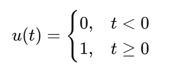

~~~python
# 阶跃信号的到来，表示信号从一个状态突然变化到另一个状态
# u(t) 阶跃信号函数
在 t=0 时，阶跃信号出现的时刻
在 t<0 时，u(t)函数 输出0，表示阶跃信号还未发生
在 t≥0 时，u(t)函数 输出1，表示阶跃信号已经发生
~~~

### 冲激信号

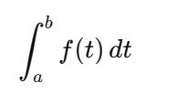

~~~python
# 一个需要记录的数学知识
# 上图的符号，似乎是所谓微积分中的积分符号
∫ 		 符号		-->		表示求和、循环
a、b 	范围 		-->	   表示循环范围，也就是t的取值范围，这个范围包含a、b自身，也就是 >= or <=
f()		 符号 	-->		函数
t		 输入值
dt		符号
	-->	表示输入值t不是一个具体的数
    --> 有一个具体的集合表示t时，该集合内>=a的数，b<= 的数将被带入f函数
    -->	没有一个具体集合表示t时，t是无穷无尽的数，要把t分割为无限小，然后带入f函数
# 总结
将在范围a和b之内，t的所有元素，带入f中，然后对f产生的所有数进行求和
t 是一个无穷尽的数组 或 一个具体数组

# 简单理解
a、b 	是 X 轴的范围
f(t)	是通过x轴生成y轴数据的函数
输出结果：坐标数据覆盖的面积
~~~

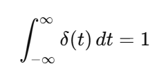

~~~python
# 冲激信号的含义是: 对系统的测试，模拟外界变化时 系统的耐受值和反应
# &(t) 这个函数的输出是，X轴无穷左，到无穷右的范围内，Y都是0。X轴是0是y是无穷大。
学了半天上面的数学符号，似乎还是没学好，无法解释输出为什么是1？
这里的结果应该是无数个0与一个无穷大相加输出应该是一个无穷大才对。

 
如果感性理解理解的话似乎不难解释，相对于无穷长的X轴都是0，X轴的一个点上即便是无穷大，平均下来也不算什么。
最终就是一个点上的数据无穷大，平均到无穷个数据点上，刚好是: ∞  / ∞ = 1

在换一种理解。
&(t)是描述一个冲激信对一个正常信号的干扰。
输出的0，是未受到干扰的情况原始数据。
X 轴是信号持续的时间，Y是对信号的干扰幅度。
此时面积(积分?)的含义就是平均干扰。
无穷大干扰，平均到无穷大X轴，刚好是: ∞  / ∞ = 1
~~~

### 抽样函数

~~~python
# sa(t) = sin(t) / t
# sa(t)，是一个偶函数
t = 0	--> 输出 1
t != 0 -->  输出 sin(t) / t

# sin(t) 好像叫正弦函数是个通用基础知识
画一个半径为1的圆
在圆心出画一个直角三角形
角1在圆心上
角2在圆边上
sin(t)函数就是，输入角1的角度，输出角2的坐标

# sinc(t) = sin(πt) / πt 
~~~

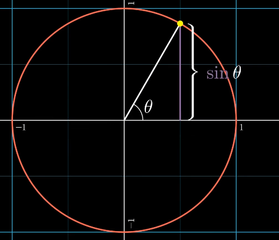

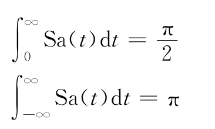

### 自变量

~~~python
# X(t) 	表示原始信号
# X(± 2t ± 6)  表示新信号
# X() 不知道含义
# (2t) 频率提高2倍
# (-2t) 信号倒放，频率提高2倍
# + 向左移动 - 向右边移动
# 信号倒放时，移动反向改变

# 假设使用 X(t) 	表示原始信号
# 假设使用 X(2t+6)  表示新信号
含义：
	- 2t 频率加快为原始信号的2倍
	- +6 波形左移 6 / 2 = 3个单位
    

    
# 假设使用 X(t) 	  表示原始信号
# 假设使用 X(-0.5t -6)  表示新信号

含义：
	* - 波形Y轴对折，信号移动反向反转
	* 0.5t 频率减慢为原始信号的2倍
	* -6 波形左移 6 / 0.5 = 12个单位
    
要还原信号时：
	* 先还原移动，移动时也要对波形单位进行处理
	

~~~

# 系统

~~~python
线性系统
时不变系统
因果系统
稳定系统
无记忆系统
可逆系统
~~~

## LTI系统时域分析

~~~python
~~~

# 前置知识

## 似乎是叫微积分的知识

### 概念

- 当有一个函数时微积分才可以使用

- 当有数据而非函数时应该不叫微积分，这应该是本能反应，没有名字

- 数学本来是 1 ==1 ，微积分通过引入 1== 0.99...的概念，拓展数数学的边界，使其可以处理一些本来需要在现实领域处理的问题

  

### 微分

- 微分用于求输入值与输出值的变化(斜率?)
- 在计算斜率时通过引入无穷小的变量，在无穷小变量无法化解时，在公式中忽略对该无穷小变量的 加减 之类低影响计算，我们就得到了**微分斜率公式(乱取的不知道怎么称呼)**

- 我水平有限，大概只对小学基础知识掌握了个7788，对小学以上的基础知识基本不知道，所以我无法发现这个导出的微分斜率公式有什么好处，当我们有一个函数时，本身就可以和微分一样，通过一个输入值获取一个斜率的输出
- 毫无基础(依据)的猜测一下好处
  - 这个无穷小的概念导致的误差小
    - 应当误差不存在时，结果无误差
    - 当误差存在时，误差只等于有某种依据的最小误差
  - 提供一种无任何负担的计算方式，对本能计算方式有微弱提升，对统一有微弱提升

### 积分

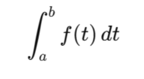

~~~python
# 积分公式相当于对问题的总结，或者说简化描述
# 可以导出一个具体的值，或者一个计算值的工具
∫a、b   需要计算什么面积的范围
f()		函数，生成Y轴的函数
t		声明输入是X轴
dt		d声明他后面的变量无穷小，或者说变量是"线"
~~~

- 积分用于求输入值与平均输出值的乘积(面积)(定积分？)
- 同微分，可以通过函数导出一个积分公式，不过没有像微分一样学了一下导出过程了
- 推测导出的是什么
  - a和b是概念数、有值概念数？(变量？)、具体值
    - 导出具体值
  - a和b是未知数
    - 导出时带a和b的公式
- 积分有多种不如常见的还有通过微分斜率公式获取y=f(x)(不定积分)，等等

### 总结

- 微分，导出某个点上，X、Y的变化率公式
- 定积分，导出 **X * avg(Y)**，的公式或者结果
-  其他积分。。。

- 这似乎是一种**维度知识(具体叫什么不知道瞎取的名字)**的应用
- 积分通过 面降维为线，让曲面不存在
- 整体考虑时，通过对数学里面1==1，这种基本概念的偶尔复杂化(篡改？)，极大的拓展的数学的边界(维度？)
- 如果用历史来理解，这似乎可以比喻为一种改革，从这两天学信号与系统时来看，这东西出现非常非常多，所以这很明显是一次非常成功的改革
- 最后，这就是对道德经里面阴阳变化的，一次非常好演示案例，有助于体会阴阳，在我身上似乎出现了阴阳之后的境界姑且称为 **人之阴阳 or 夺阴阳之造化 or 阴阳使用 or 阴阳可用**，不过这感觉来的也的快，去的也快，没能让我达到阴阳的下一境界。顺手总结一下已知的阴阳两个境界。(龙？对阴阳引入变量，time？)
  - **阴阳现**，阴阳既现，当知阴阳绝不可用
  - **阴阳可用**，阴阳既绝不可用，代表阴阳绝对可用。如何使用似乎模模糊糊来了点感觉: 死生？-->明悟自身？==落地?==真假传合而契机现-->使用==到达
  - **。。。**
- 神髓已隐，再看记录下的文字都是一些盲人摸象，照猫画虎的东西。 

## 似乎是叫三角函数 or 直角三角比的知识

### sin(x) 正弦

#### 基本概念

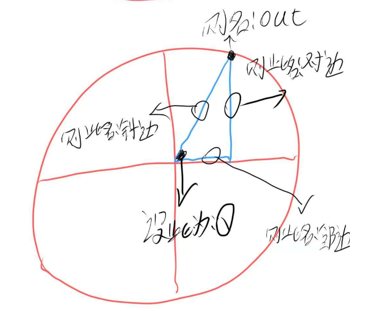

- 直角三角形，设一个圆心角为θ，非直角为out
  - 输入: θ的角度
  - 输出: 对边 / 斜边    OR    如果圆的半径等于1，则也是out的Y轴坐标
- 直观理解
  - 为 θ 输入一个360度的角度
  - 输出一个 1 ~ -1 的循环值

#### 实际作用

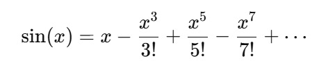

- 可以输出一组周期波动的数据
- 输入值似乎用的是一个叫弧度的东西，弧度是什么暂时不看了，反正就是一个映射范围，将0~360映射到 0 ~ 6.28完事
- 该公式似乎输入越接近0输出精度越高，所以这里将 0~360，所以映射到 -3.14 ~ 3.14

~~~python
import numpy as np
import matplotlib.pyplot as plt
import math
plt.rcParams["font.family"] = ["SimHei"]
plt.rcParams["axes.unicode_minus"] = False

def 阶乘(n):
    if n == 0:
        return 1
    result = 1
    for i in range(1, n + 1):
        result *= i
    return result

# 输入弧度，输出SIN值
def sin(x,次数=10):
    # 对360度以外的东西取模，保证输入范围在360度
    x = x % (2 * math.pi)
    if x > math.pi:
        x -= 2 * math.pi

    # 通过公式计算SIN的值，并返回
    t = 0
    for i in range(1,次数):
        if i %2:
            t -= x**(i*2+1) / 阶乘(2*i+1)
        else:
            t += x ** (i * 2 + 1) / 阶乘(2 * i + 1)
    return x +  t

# 输出一组弧度对应的sin值
def sin_list(x):
    if type(x) == type(np.linspace(-10, 10, 1)):
        y = []
        for i in x:
            y.append(sin(i))
        return y
    return None

# 每2派的弧度为一个周期,这里生成10派数据，也就是5个周期
x = np.linspace(-math.pi*4 ,math.pi*6, 1000)
y = sin_list(x)

# 显示
plt.plot(x, y, linewidth=2)
plt.title('sin(x)的周期值图像')
plt.xlabel('角θ值')
plt.ylabel('sin 值')
plt.grid(True, linestyle='--', alpha=0.7)

plt.tight_layout()
plt.show()
~~~

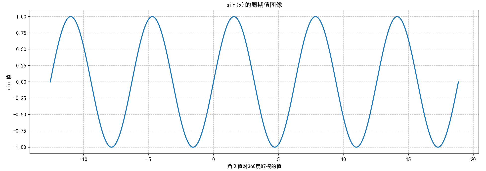

### cos(x) 余弦

- 同理正弦所以这里不做学习了

- 只是将直角边放在了圆边
- 输出波形只是初始位置不一样(相位？)

~~~python
import numpy as np
import matplotlib.pyplot as plt
plt.rcParams["font.family"] = ["SimHei"]
plt.rcParams["axes.unicode_minus"] = False

# 定义 x 值
x = np.linspace(-2 * np.pi, 2 * np.pi, 1000)

# 计算 sin(x) 和 cos(x)
y_sin = np.sin(x)
y_cos = np.cos(x)

# 绘图
plt.plot(x, y_sin, label='sin(x)', color='blue', linestyle='--', linewidth=2)
plt.plot(x, y_cos, label='cos(x)', color='red', linewidth=2)
plt.title('sin(x) 与 cos(x) 的图像对比')
plt.xlabel('x')
plt.ylabel('函数值')
plt.legend()
plt.grid(True)
plt.show()

~~~

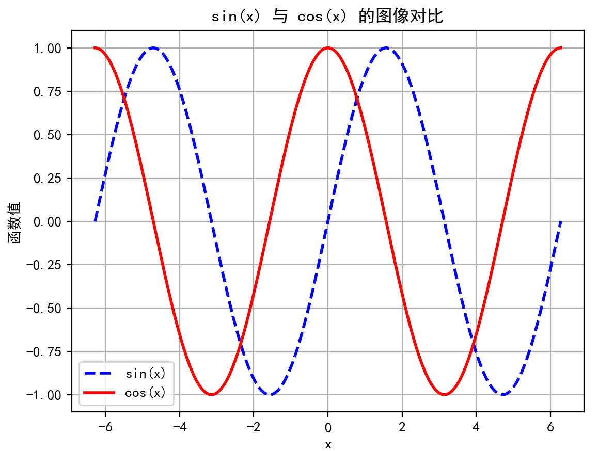

### tan(x)

tan(x) = sin(x) / cos(x)

没用到，顺便看一下图像，不知道是干什么的

~~~py
import numpy as np
import matplotlib.pyplot as plt

plt.rcParams["font.family"] = ["SimHei"]
plt.rcParams["axes.unicode_minus"] = False

x = np.linspace(-2 * np.pi, 2 * np.pi, 1000)
y_sin = np.sin(x)
y_cos = np.cos(x)
y_tan = y_sin / y_cos

plt.plot(x, y_sin, label='sin(x)', color='blue', linestyle='--', linewidth=2)
plt.plot(x, y_cos, label='cos(x)', color='green', linestyle='--', linewidth=2)
plt.plot(x, y_tan, label='tan(x)', color='red', linewidth=1)

# 限制 y 轴范围，不然 tan(x) 震荡太大
plt.ylim(-10, 10)

plt.title('sin(x)、cos(x) 与 tan(x) 的图像对比')
plt.xlabel('x')
plt.ylabel('函数值')
plt.legend()
plt.grid(True)

plt.show()
~~~

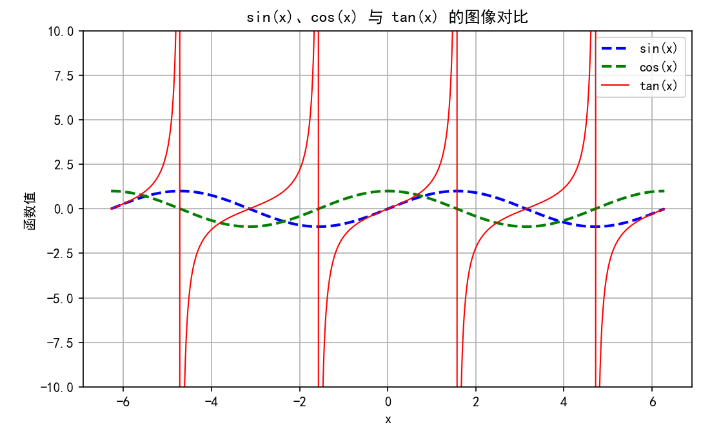

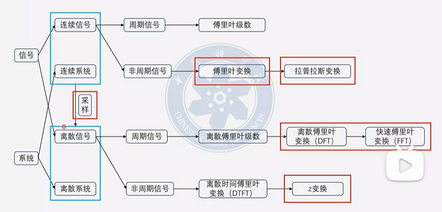

### 复数

a+bi  == a+bj	

# 傅里叶变换是什么

### 傅里叶变换是什么

~~~python
# 信号从时域变换为频域
# 在频域中处理不同频率的数据
# 将数据从频域中返回到时域中

# 时域
简单来说X轴是时间，Y轴是数据

# 频域
简单来说X轴是频率，Y轴每个频率的振幅？
~~~

### 任何周期函数都可以由三角函数组成

# 时域与频域

## 定义
- 时域：X轴是时间，Y轴是信号值
- 频域：X轴是频率，Y轴是幅度/相位

## 转换手段

- 连续
  - 周期
    - 傅里叶级数
  - 非周期
    - 傅里叶变换
    - 拉普拉斯变换（更一般的复域分析）

- 离散
  - 周期
    - 离散傅里叶级数(严格理论，分析一个无限周期信号)
    - 离散傅里叶变换 (DFT) 及其高效算法 FFT
  - 非周期
    - 离散时间傅里叶变换 (DTFT) （频谱是连续的）
    - Z变换（更一般的复域分析）

# 傅里叶视频1

周期为2p的函数可以展开为傅里叶级数

# 傅里叶视频2 

## 卷积

吃包子血糖例子，知道冲击信号到达时系统输出的是什么，求冲击信号一直来时，输出的函数。

或者说卷积就是，知道信号的输入和输出，求系统干了什么。

## 零散

### 运放带宽(增益带宽积)

100M带宽放大10倍，带宽还剩1 M

带宽不足，放大倍数变小

## 频域

- 时域：X轴是时间，Y轴是信号值
- 频域：X轴是频率，Y轴是幅度/相位 
- 调制域: X轴是时间，Y轴是频率

### 

## 信号相关性，频率，相位

# DFT

## 使用现象

### 混叠

- 采样频率不够本身就会导致，采样到的波形变形

- 采样率 >= 期望分辨频率10倍 OR 2倍

### 泄露

- 没有采样到完整周期
- 比如采样到1个半，两个半周期

