### 元器件

#### 单片机封装

##### DIP 直插

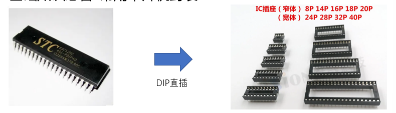

##### PLCC 卡槽

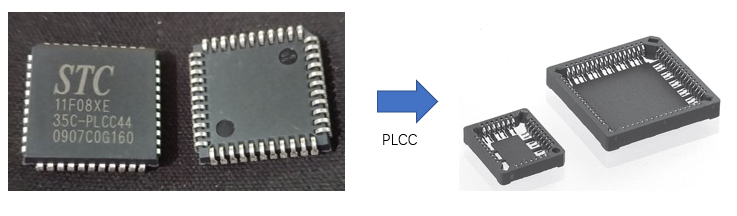

##### QFP 贴片4边引脚	

> 引脚的疏密程度不同，再次区分
>
> TQFP
>
> PQFP
>
> LQFP

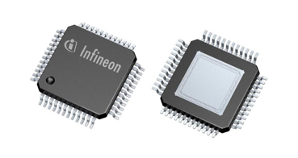

##### SOP 贴片2边引脚

>引脚的疏密程度不同，再次区分
>
>SSOP
>
>TSSOP

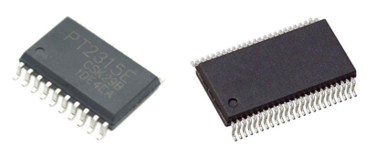

##### QFN

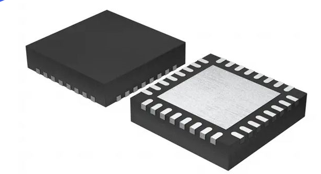

##### BGA

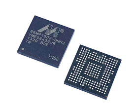

### 通用知识

#### I2C 

两线制，分主机和从机

SDA 数据线

SCL 时钟线

#### SPI

4线制，分主机和从机

时钟线

主机发，从机收

主机收，从机发

CS: 片选,低电平时选中指定单片机，每个单片机都需要独立一个片选线

### C51

#### 命名规范

##### STC89系列规范

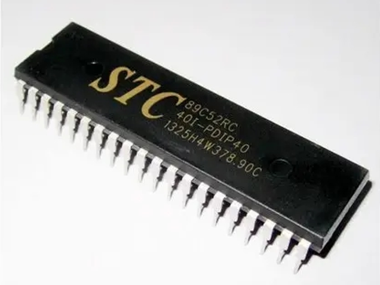

##### 示例 

> 完整名称
>
> ​	 STC89C52RC
>
> ​	40I-PDIP40
>
> ​	1325H4W378.90C

##### STC89 

- 代表型号

##### C

- 代表工作电压
  - C: 5.5V~3.3V
  - LE: 3.6V~2.0V

##### 52

- 程序空间大小(硬盘)
  - 51: 4K字节
  - 52: 8k字节
  - 53: 13k字节
  - 54: 16K字节
  - 58: 32K字节
  - 516: 64K字节

##### RC

- 内存大小
  - RC: 512位
  - RD+: 1280位

##### 换行

##### 40 

- 工作频率
  - 40MHz

##### I

- 工作温度
  - I: 工业级, -40C ~ 85C
  - C: 商业级, 0C ~ 70C
  - A: 汽车级, -40C ~ 125C
  - M: 军工级, -55C ~ 150

##### - 分割 

##### PDIP 

- 封装类型

##### 40

- 管脚数

##### 换行

##### 1325

- 生产批次号
- 13年25周

##### H4W378.

- 未知

##### 90C

- 版本号 

#### 规格

#### 最小系统

#### 管脚图

#### 读取按键的一次按下

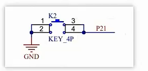

~~~c
#include "stc.h"

void main() {
    gpio_init(g5,p1,SX);	// 初始化按键的引脚
    gpio_init(g4,p5,TW);	// 初始化led总开关的引脚
    gpio_init(g2,p1,SX);	// 初始化led的引脚
    P45 = 0;	// 打开LED总开关
	

    while(1)
    {
        if(P51==0)        //1.判断按键是否按下
        {
            sleep(10);    //2.延时10ms消抖
            if(P51==0)      //3.再次判断按键是否按下
            {
                P27=~P27;    //4.改变LED灯状态
                while(P51==0);//5.等待按键松开，防止重复执行
            }
        }
    }

}
~~~

#### 中断

##### 说明

程序运行中收到中断请求时，会先执行中断函数的内容。执行完毕后，接着继续执行中断前的内容。

##### 中断优先级

##### 中断源

###### 说明

查看数据手册单片机有多少个中断源

###### 外部中断

一般由某个引脚引发，触发方式为 **低电平** 或者 **下降沿**

###### 定时器中断

###### UART中断

##### 中断开关

一般每个中断源都有自己的独立开关，同时还会有一个总中断开关

##### 中断函数

触发中断时会执行中断函数

~~~c
// 格式
void 函数名()interrupt 中断源编号 [using 寄存器组可选]{
    
}

// 示例
void abc()interrupt 0{
    
}
~~~

##### 使用步骤

1. 查看单片机有哪些中断源
2. 查看设置中断优先级的方式
3. 查看中断源的触发方式
4. 查看中断开关的打开方式
5. 查看中断源的编号，编写中断函数

##### 示例

~~~C
#include <STC89C5xRC.H>
#include "intrins.h" 

void Delay1ms(int a)		//@11.0592MHz
{
	unsigned char data i, j;

	while(a--){
			_nop_();
	i = 2;
	j = 199;
	do
	{
		while (--j);
	} while (--i);
	
	}

}

void main(){
	IT0 = 1;	// 外部中断0,下降沿触发还是低电平触发
	EA =1;	// 中断总开关
	EX0 =1; // 外部中断0开关
	
	while(1){
	
	}

}

void abc()interrupt 0{
	Delay1ms(10);	// 接的按键，延迟防抖
	if(P32 == 0){	// 判断中断是否真的触发
		P24 = ~P24;	// 开关led灯
		while(P32 == 0);	// 按键松开后，再退出中断函数
	}
}
~~~

#### 定时器

##### 说明

每隔一段时间产生一个中断

定时器启动后会从**外部引脚**或者**内部时钟**上获取计数，当计数满时会产生一个中断

##### 定时器的模式

##### 示例

~~~c
#include <STC89C5xRC.H>

unsigned int delay_flag = 0;

//延时n ms函数
void Delaynms(unsigned int n)
{
	while(1)
	{
		if(delay_flag >= n)
		{
			delay_flag = 0;
			break;
		}	
	}
}

void main()
{	
	//1.外部晶振为11.0592MHz,12分频
	//2.使用定时器0,模式1
	TMOD|=1<<0;   
	TMOD&=~(1<<1); 
	
	//3.设置计数脉冲源：C/T
	TMOD&=~(1<<2); //C/T=0
	
	//4.设置TL0、TH0初始值
	TL0=0x66;
	TH0=0xFC;
	
	//5.启动定时器:设置GATE、TR0
	TMOD&=~(1<<3); //GATE=0
	TCON|=1<<4;    //TR0=1
	
	//1.使能定时器0中断
	ET0=1;
	//2.使能总中断
	EA=1;

	while(1) 
	{			
		P20=0;       //1111 1110
		Delaynms(1000); 
		
		P20=1;       //1111 1111
		Delaynms(1000);						
	}		
}

void time0() interrupt 1 //3.定时器0中断函数
{
    // 每次定时器触发重新装填默认值
	TH0=0xFC;	             //4.给定时器赋初值，定时1ms
	TL0=0x66;
	
	delay_flag++;
}
~~~

#### UART

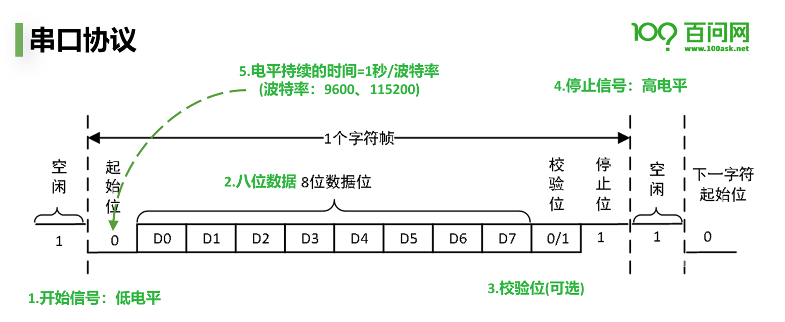

##### 软件实现收发数据示例

~~~C
#include <STC89C5xRC.H>

void Delay104us2()		//@11.0592MHz
{
    unsigned char data i;

    i = 35;
    while (--i);
}

void Delay104us()		//@11.0592MHz
{
    unsigned char data i;

    i = 40;
    while (--i);
}

void Delay52us()		//@11.0592MHz
{
    unsigned char data i;

    i = 20;
    while (--i);
}

// 发送一个字符
void uart_send(unsigned char tdata) {
    unsigned char i=0;
    unsigned char j=0;

    // 起始信号
    P31 = 0;
    // 延迟时间来自计算
    //（1 / 9600）* 1000 单位是毫秒
    //（1 / 9600）* 1000 *1000 单位是纳秒
    Delay104us();

    //发送数据
    for(i=0; i<8; i++) {
        P31 = tdata & 0x01;	// 判断最后一位是否为1
        tdata= tdata >> 1;	// 右移1位
        Delay104us();

    }

    //结束信号
    P31 = 1;
    Delay104us();

}

// 发送一个字符串
void println(unsigned char* tdata,unsigned char t_len) {
    unsigned char j=0;
    for(j=0; j<t_len; j++) {
        uart_send(tdata[j]);
    }
    uart_send('\n');
}

// 接收一个字符
unsigned char uart_read(void) {
    unsigned char i = 0;
    unsigned char rdata = 0;

    // 开始接收数据
    if (P30 ==0)
    {
        Delay52us();	// 延迟一会确定是发送信号
        if (P30 ==0)
        {
            for(i=0; i<8; i++)
            {
                Delay104us2();          // 每次接收间隔104微秒
                if(P30 == 1)           // 判断是否为高电平
                {
                    rdata |= 1<<i;		  // 组织收到的每一位数据
                } else {
                    rdata |= 0<<i;	// 没有用处，在这里时为了占用时间
                }
            }
        }

        Delay104us2();	// 延迟一会确定是结束信号

        if(P30 == 1)               // 结束信号
        {
            return rdata;
        }
    }

}

void main() {
	
    unsigned char t =0;
	
		// 循环接收数据
    while(1) {
			
				// 接收到的数据
        t = uart_read();
        if( t == 0x00) {
            continue;
        } else if(t == 0xaa) {
            P20 = 1;
        } else if(t == 0xbb) {
            P20 = 0;
        } else {
            println(&t,1);
        }
    }
}
~~~

### stm32

#### 指令集

精简指令集   Reduced Instruction Set Computer  RISC

复杂指令集   Complex Instruction Set Computer  CISC

#### ARM M 系列处理器

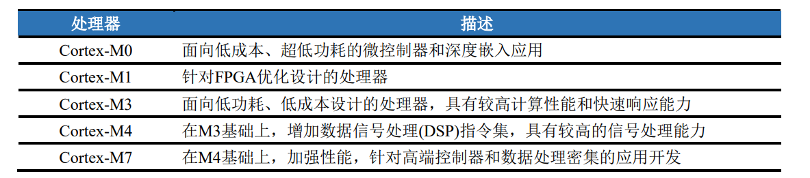

#### STM32 分类

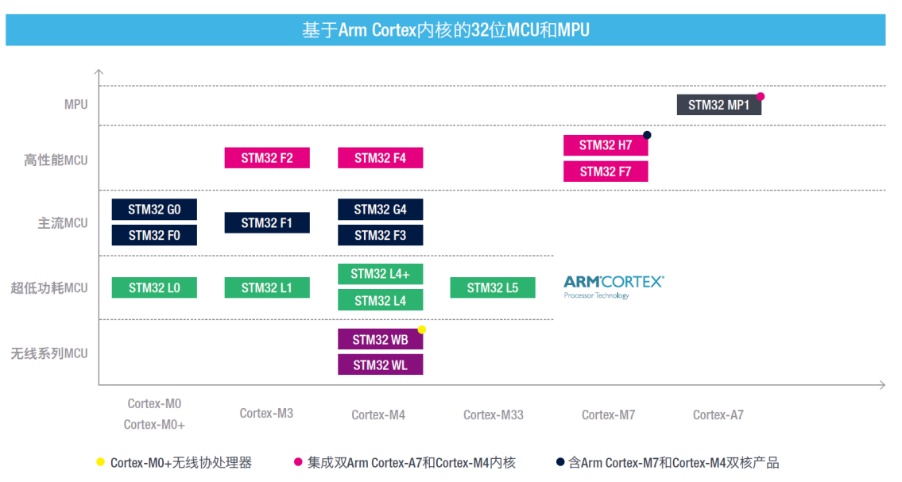

#### STM 命名规则

##### 规则

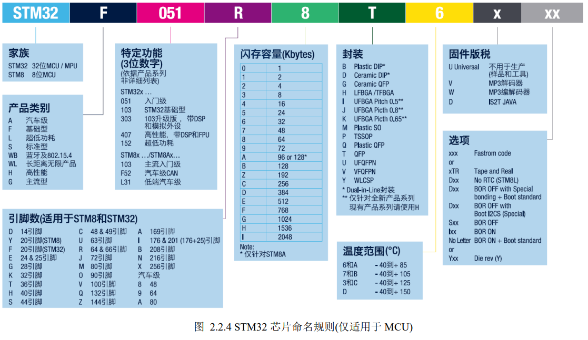

##### 示例

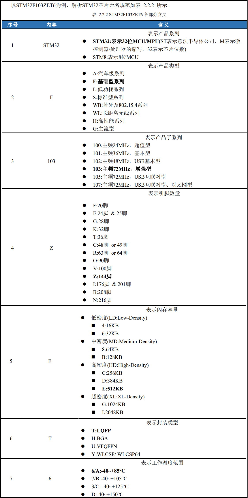

#### 常见处理器概念

##### MCU

>微控制器 (Micro-Controller Unit ， MCU) ，俗称单片机。之所以称之为单片机 (Single Chip  Microcomputer)，是因为不同于其它处理器，它将CPU、RAM(随机存储器)、ROM(只读存储器)、I/O、中 断系统、定时器等各种功能外设资源集中到一个芯片上。这个芯片就是一个完整的微型计算机，只需要供 电或加上极少的外围电路即可工作。 常见的MCU有80C51系列单片机、Atmel公司的AVR系列单片机、Microchip公司的PIC系列单片机、TI 公司的MSP430系列单片机、ST公司的STM32系列单片机、NXP公司的LPC1700系列单片机。 早期的MCU主要是8位，后面发展出16位，再到现在主流的已经是32位。此外，主频不断提高、ROM不 断增大、外设不断增多，单片机的应用领域和场合越来越大

##### MPU

>微处理器(Micro-Processor Unit，MPU)。类似通用计算机的CPU，主要负责处理计算，需要外加RAM、 Flash、电源等电路。 MCU和MPU的本质

##### MCU和MPU的区别

>MCU和MPU的本质区别是因为应用场景的定位不同。
>
>MPU注重通过相对强大的运算/处理能力，执行复 杂多样的大型程序，因此常需要外挂运行内存(RAM)、存储器(Flash)等。
>
>MCU注重功能较为单一、价格敏感 的应用场景，不需要相对强大的运算/处理能力，更多的是对设备管理/控制，因此不需要大容量的RAM、Flash 来运行大型程序，于是将RAM、Flash全集成在一起，大家也就俗称“单片机”，

>如今，随着技术的发展，市场及需求的变化，MPU和MCU的界限日趋模糊。
>
>高端的32位MCU主频越来 越高，已经反超低端MPU主频，MCU也有外挂RAM和Flash的场景，依靠硬件结构去区分逐渐困难。
>
>**读者可 以简单的认为，嵌入式微处理器MPU，通常运行Linux、Android等非实时操作系统，应用在高端应用市场， 比如智能手机、路由器等消费电子市场领域，而嵌入式微控制器MCU，常用运行裸机或实时性操作系统， 应用在中、低端应用市场，比如家电控制领域、工业控制领域等。**

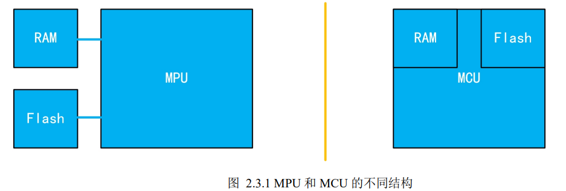

##### DSP

>DSP通常有两个含义。
>
>数字信号处理（Digital Signal Processing，DSP），是一门学科技术，使用数值计算的方式对信号进 行加工处理的理论和技术。 
>
>数字信号处理器（Digital Signal Processor，DSP），是一种专门用于数字信号处理领域的微处理器 芯片。
>
>DSP芯片为了达到快速处理数字信号处理的目的，采用了许多特殊软硬件结构。首先是采用哈佛结构， 将程序和数据分开，同时为处理器提供指令和数据。然后采用多级流水线技术，在指令周期内可以执行更多 指令。加上专用的硬件乘法器、特殊的DSP指令，使得DSP芯片在计算处理上，远超同主频的MCU或MPU。 DSP芯片拥有强大的数据处理能力，在数字信号处理领域，如调制/解调、数据加密/解密、图形处理、 数字滤波、音频处理等计算密集型的场景广泛应用。

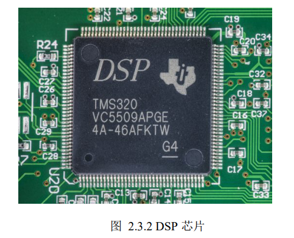

##### FPGA

>现场可编程门阵列（Field－Programmable Gate Array，FPGA），由可编程互连连接的可配置逻辑块 (CLB) 矩阵构成的半导体器件。通俗地说，FPGA就是一个可以通过编程改变内部硬件结构，实现所需功 能的芯片。前面的MCU、DSP等都是硬件资源固定，只能通过修改软件实现所需功能。而FPGA是通过硬件 描述语言或其它方式修改硬件，将FPGA变为CPU或专用芯片，来实现控制或算法。因此，MCU、DSP能够 实现的功能，FPGA理论上都可以实现，反之则不一定。

>FPGA主要有两大优势：高速和灵活。
>
>FPGA使用硬件处理数据，采用并发和流水技术，多个模块之间可 以同时并行执行。
>
>FPGA可以根据现场情况配置器件功能，能够在技术和需求变化时重新配置，实现系统优 化升级。 在某些通信领域，需要处理高速的通信协议，同时通信协议随时都可能修改，不适合做成专门的芯片， FPGA的高速、灵活就便成了首选。
>
> 虽然FPGA功能强大，但实际工程项目中，还需考虑硬件成本、开发难度和市场需求等因素。一些简单 的控制场合，尽管FPGA和MCU都能胜任，但MCU价格低廉和研发简单，更划算

##### 总结

> 如今复杂的嵌入式系统往往是复合架构，比如“MPU+FPGA”、“MPU+DSP”、“MCU+FPGA”、 “MCU+DSP”，甚至“MCU +MPU+FPGA+DSP”。
>
>控制、显示、通信一般选择MCU或MPU，通信和数据 处理算法选择DSP，大量的数据处理和特定实现选择FPGA。
>
>MCU开发需要C语言基础，然后学习各类资源、接口，再到RTOS；
>
>MPU通常运行Linux，需要Linux基 础、操作系统、网络编程等知识；
>
>DSP开发需要具备数据信号处理算法的理论知识；
>
>FPGA开发需要了解高 速接口或音/视处理算法等。 
>
>一般来说，MCU相对比较简单，适合作为入门学习，待MCU学习完后，再结合实际情况选择深入学习 方向

#### MCU和MPU开发

##### MCU

>MCU开发就是我们常说的单片机开发。
>
>MCU开发人员需要具备C语言、数字电子技术、模拟电子技术、微机原理等相关理论基础，还可能需要 电路板绘制等专业技能。涉及电子信息工程、自动化、测量控制等相关专业。 MCU开发主要涉及的内容包含：GPIO、UART、I2C、SPI、LCD等外设接口，时钟、中断、定时器、 ADC/DAC、看门狗等内部资源，以及RTOS(FreeRTOS、RT-Thread、uCOS、LiteOS等)嵌入式实时操作系统。
>
>MCU可以使用仿真器在线调试，也可以使用串口打印 调试，而MPU一般只能使用串口调试打印。

 

##### MPU

>MPU通常运行嵌入式Linux，因此也称为ARM-Linux开发。
>
>MPU开发人员需要具备、数据结构、操作系统、计算机网络等相关理论基础。涉及计算机科学、软件工 程、物联网等相关专业。 MPU开发主要涉及的内容包含：Bootload移植、Linux内核移植、Linux设备驱动开发（GPIO、UART、 I2C、SPI等）、Linux应用开发（文件I/O、多任务编程、进程间通信、网络编程、Qt界面设计等），甚至包 括Android驱动、Android应用编程。
>
>MPU开发通常没有仿真器，也没有集成开发环境IDE 工具，但MPU资源丰富，反而下载方式比MCU丰富。
>
>MCU的启动过程比较简单，而MPU的复杂很多，就Bootloader部 分就相当于一个大型MCU开发工程。两者相互补充，占据了嵌入式设备的大部分份额。

##### MCU和MPU开发的区别

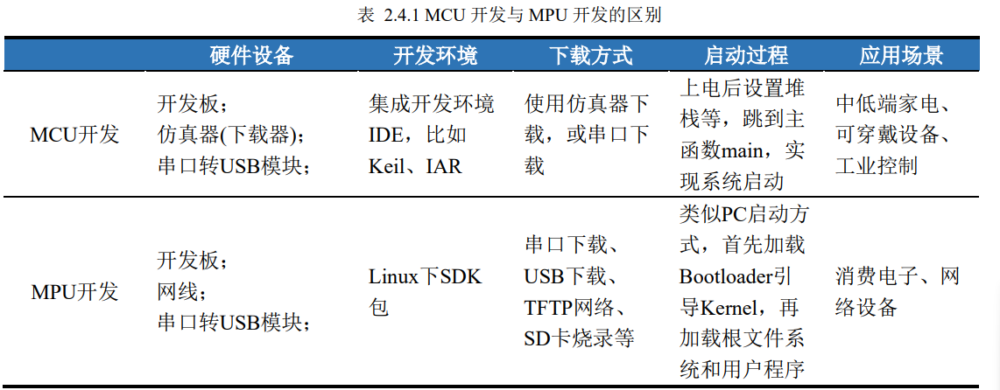

#### STM 开发文档

##### 下载位置

>www.st.com
>
>直接搜索型号，点击型号，在**文件**中分页中下载手册
>
>

##### 数据手册(产品规格)

>“Product Specifications”(产品规格)：也就是数据手册，包含该系列MCU的整体描述、引脚描述、 内存映射、电气特性、封装信息、订购信息等。在芯片选型、原理图设计、PCB设计、代码编程等 开发环节，都会需要该文档

##### 参考手册

>“Reference Manuals”(参考手册)：包含该系列MCU各外设寄存器的详细描述，在代码编程时，需要找到对应外设章节，仔细阅读

##### 编程手册

>“Programming Manuals”(编程手册)：包含闪存编程手册和Cortex-M3内核编程手册，一些资源是 在内核里的，比如NVIC和SysTick，此时在参考手册里找不到相关寄存器信息，就需要在Cortex-M3 内核编程手册里查找

##### 勘误手册

>“Errata Sheets”（勘误手册）：包含该MCU内核、外设资源的限制，解决方案等，在调试中出现 了bug，可以看看该手册是否有类似记录

#### 开发环境

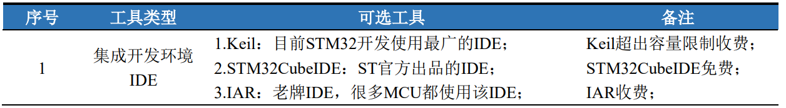

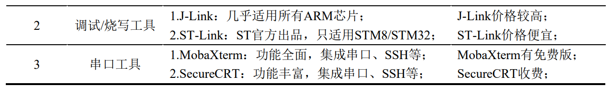

##### IDE

>KEIL 官网下载 **MDK** 安装
>
>安装好后有一个 **packinstaller.exe** 软件，下载开发板对应的包

##### 烧写工具

ST-Link

https://www.st.com/en/development-tools/stsw-link009.html

##### 串口调试

MobaXterm

https://mobaxterm.mobatek.net/download.html

#### 原理图常用元器件

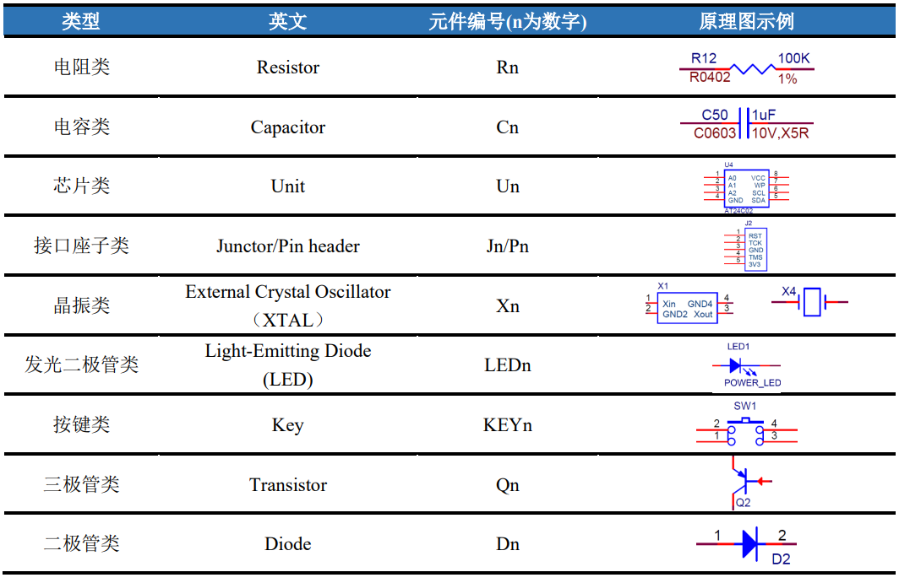

### PICO

#### 规格参数

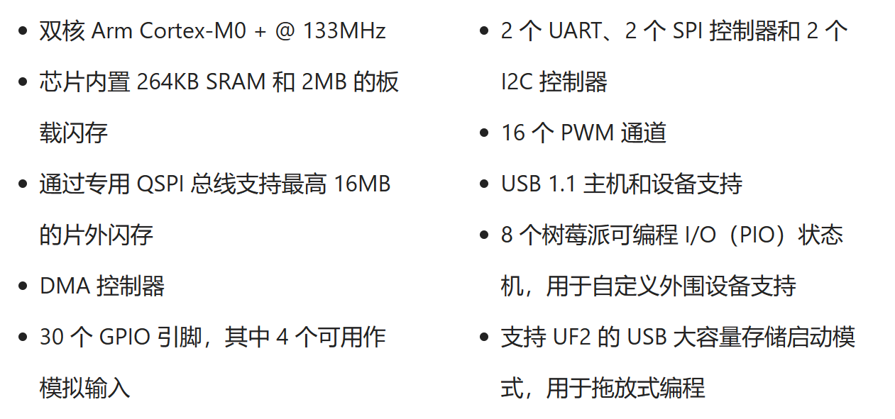

#### 引脚图

所有引脚都支持外部中断

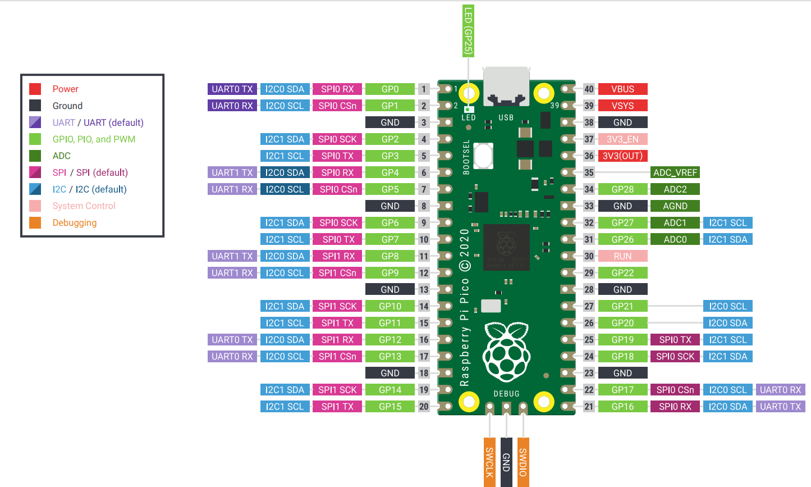

 [Pico-R3-A4-Pinout.pdf](..\src\单片机\Pico-R3-A4-Pinout.pdf) 

### ESP32

#### 引脚图

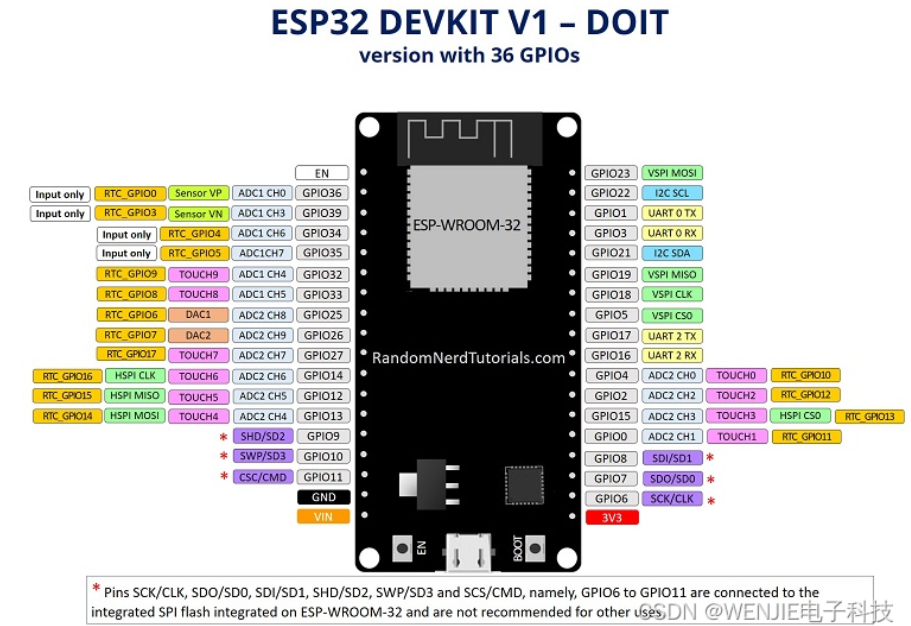

#### 建议使用的引脚 

ADC 引脚使用 39,36,34,35,32,33  **32-36+39**

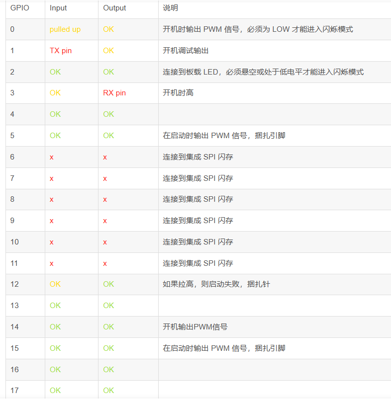

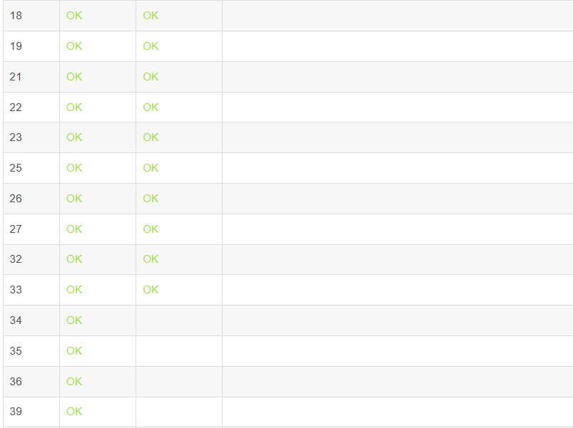

### ESP8266

#### 引脚图

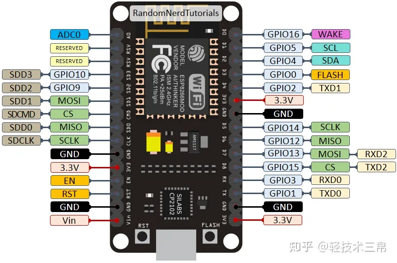

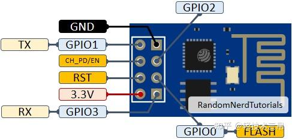

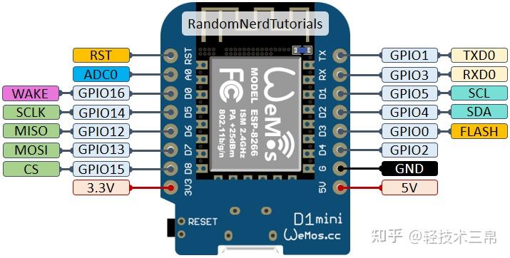

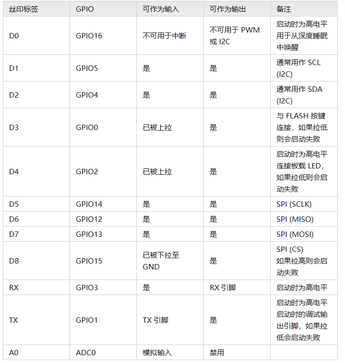

#### 建议使用的引脚

支持**中断、pwm**的gpio

D1     D2     D5	D6	D7

5	4	14	12	13

### MicroPython

#### 创建引脚对象

~~~python
# import test
import time

from machine import Pin as pin

LED = Pin(2,pin.OUT)    # 创建引脚对象,输出模式

while True:
   LED.value(0) # 输出低电平
   time.sleep(1)
   LED.value(1) # 输出高电平
   time.sleep(1)

~~~

#### 数码管使用    

#### 按键使用

~~~python
import time

from machine import Pin as pin

def 反转led():
    if led.value() == 0:
        led.value(1)
    else:
        led.value(0)

# 下拉默认为低电平，接通高电平时为高电平
# 上拉默认为高电平，接通地时为低电平
but = pin(14, pin.IN, pin.PULL_UP)    # 创建引脚对象
led = pin(27, pin.OUT)

while True:
    if but.value() == 0:
        time.sleep_ms(20)   # 刚刚按下时电平还未稳定,消抖
        if but.value() == 0:
            反转led()
            while but.value() ==0:  # 没放开按键就阻塞在这里
                pass
            time.sleep_ms(20)   # 刚刚放开时电平还未稳定,消抖

~~~

#### PWM

~~~python
import time

from machine import PWM, Pin

# freq 高电平+低电平时间=一个周期。每秒多少个周期。40MHz,最大40*1000*1000
# duty_u16 占空比,高电平时间持续时间,16位 0~65535
# duty 占空比,高电平时间持续时间,10位 0~1023
led = PWM(Pin(2), freq=20000, duty_u16=512)
led.freq(40*1000*1000)
led.duty(1023)
led.duty_u16(65535)
~~~

#### 舵机

#### ADC 模数转换

将电压通过数字读取出来

##### 函数

~~~python
import time
from machine import Pin, ADC

# 在 26 引脚创建 ADC 对象
adc = ADC(Pin(26))

# 获取 ADC 值
# 测量精度为 12 位，返回 0-4095（表示 0-1V）
val = adc.read()
# 返回 0-65535 范围内的整数。返回值表示 ADC 获取的原始读数，按比例缩放，最小值为 0，最大值为 65535。
val_u16 = adc.read_u16()

# 配置衰减器，能增加电压测量范围，参数可以是 ADC_ATTN_0DB（0dB 衰减，最大输出电压为 1 V, 默认配置）
# ADC_ATTN_2_5DB（2.5dB 衰减，最大输出电压为 1.34 V）、
# ADC_ATTN_6DB（6dB 衰减，最大输出电压为 2 V）、
# ADC_ATTN_11DB（11dB 衰减，最大输出电压为 3.3 V）
adc.atten(ADC.ATTN_11DB)

~~~

##### 示例

~~~python
import time

from machine import ADC, Pin

# 在 26 引脚创建 ADC 对象
adc = ADC(Pin(26))

# 配置衰减器，配置测量量程为 3.3V
adc.atten(ADC.ATTN_11DB)

while True:
    print(f'adc:{adc.read_u16()}')
    time.sleep(0.1)

~~~

#### PICO 电压测量

~~~python
import time

from machine import ADC, Pin

ADC0 = ADC(1)  # 通过GPIO26初始化ADC
sensor_temp = ADC(4) # 指定初始化ADC通道4，其对应片内温度传感器

while True:
    read_voltage = ADC0.read_u16()*3.3/65535   # 读取ADC通道0的数值并根据ADC电压计算公式得到GPIO26引脚上的电压
    read_temp_voltage = sensor_temp.read_u16()*3.3/65535    # 计算出ADC通道4上的电压
    temperature = 27 - (read_temp_voltage - 0.706)/0.001721   # 温度计算公式，即可计算出当前温度
    print("ADC0 voltage = {0:.2f}V \t\t  temperature = {1:.2f}℃ \r\n".format(read_voltage, read_voltage))    # 将GPIO26上的电压输出到控制台，将当前温度输出到控制台
    time.sleep_ms(1000)
~~~

### ADC 模块选型

#### 微分线性误差

~~~shell
# 含义
	单个刻度的大小，可能会偏大或者偏小多少
# 搜索别名
	DNL
# 单位
	LSB：±2LSB表示单个刻度可能偏大3倍或者为0
~~~

#### 积分线性误差 

~~~shell
# 含义
	当前刻度的位置是否准确
# 搜索别名
	INL
# 单位
	LSB：±2LSB，则采集到2，真实值可能是0~4之间
	ppm：误差百万分之多少
~~~

#### 偏移误差 

~~~shell
# 含义
	基准位置是否正确，积分线性误差 ，这个是整体的位置误差，相当于没对齐
# 搜索别名
	偏置误差
	Offset Error
# 单位
	LSB：±1LSB表示，采集到10，真实值可能是9~11之间
	v：1mv，表示采集到10mv时，时间电压可能是9mv~11mv
~~~

#### 增益误差

~~~shell
# 含义
	不太理解，叠加上积分线性误差，两个加起来为ADC整体误差应该可以
# 搜索别名
	Gain error
# 单位
	%：
		0.1%的误差，12位单片机，4095位读数。
		4095 / 1000 ≈ 5LSB
	LSB：
~~~

#### 有效位数

~~~shell
# 含义
	adc值的可靠位数，不太理解
# 搜索别名
	Effective Number Of Bits
	ENOB 
~~~

#### PGA

~~~shell
# 含义
	配置放大倍数，或者控制采集范围
~~~

#### 速率

~~~shell
# 含义
	每秒采集第三次信号
# 搜索别名
	速率
	AD速率
	Fs
~~~

#### 功耗

~~~shell
# 含义
	不同条件下消耗的电量
~~~

#### 分辨率

~~~shell
# 含义
	采集到的数据是2的多少次方
~~~

#### SNR

~~~shell
~~~

#### 填空模板

单位搜索 %，PPM，LSB

~~~shell
为我找到该ADC芯片的这几个参数。
微分线性误差（DNL）：
积分线性误差（INL,Integral Nonlinearity） ：
偏移误差（偏置误差，Offset Error）：
增益误差（Gain error）：
有效位数（Effective Number Of Bits，ENOB）：
速率：
分辨率：
PGA：
~~~

#### ADS1115IDGSR

~~~shell
为我找到该ADC芯片的这几个参数。
微分线性误差：未找到
积分线性误差：1LSB  ±2.048V时
偏移误差 ：典型值±1 最大误差±3   ±2.048V时
增益误差：±2.048V时
	典型值0.01% 		6.5535-LSB
	最大误差0.15%		98.3025-LSB
有效位数：
速率：可编程，8 SPS至860 SPS
分辨率：16位
PGA：
	±6.144V
	±4.096V
	±2.048V
	±1.024V
	±0.512V 
	±0.256V
封装: VSSOP-10

实际误差:	±2.048V时
	每刻度对应电压mv = 0.03125047684443427176317998016327
	1+3+99 = 103LSB * 每刻度对应电压ua  = 3.218799mv  
~~~

### 运算放大器选型

#### 参数

~~~shell
#工作电压(VS)

#失调电压(VOS,Input Offset Voltage)
	偏置电流 
	失调电流
# 开环电压增益(Aol、db)
	误差:
		开环电压增益 - 实际放大倍率 >= 40DB	误差1%
		开环电压增益 - 实际放大倍率 >= 60DB	误差0.1%
	放大倍率快查：
		20db == 10倍放大
		40db == 100倍放大
		45db == 177.83倍放大
		50db == 316.23倍放大
		55db == 562.34倍放大
		60db == 1000倍放大
	计算公式:
		放大倍率 = 10 ^ (db / 20)
	
# 电源抑制比(PSRR、db)
	忘记了
# 压摆率(SR)
	每us，电压最大变化范围
# 开环输出阻抗(Zo)
	VOUT输出时的内部电阻
# 短路电流(ISC)
	输出电流(Output Current (IO) )
	一定程度可以知道,运放的输出能力
	
# 轨到轨(Rail-to-Rail)
	VOL	 最低输入 
	VOH  最高输出
~~~

#### GPT快查

~~~shell
工作电压(VS)
失调电压(VOS)
	偏置电流 
	失调电流
开环电压增益(Aol、db)
电源抑制比(PSRR、db)
压摆率(SR)
开环输出阻抗(Zo)
短路电流(ISC)
	输出电流(Output Current (IO) )
输入电压范围
输出电压范围
共模抑制比
为我提供这些参数
~~~

#### [Tokmas(托克马斯)](https://list.szlcsc.com/brand/12489.html)     [OPA2335](https://item.szlcsc.com/8523329.html?fromZone=l_c__%22catalog%22)

| 参数                          | 详情                                                         |
| ----------------------------- | ------------------------------------------------------------ |
| 工作电压(VS)                  | 单电源：+1.8V ~ +5.5V                                        |
| 失调电压(VOS)                 | 典型值：1μV，最大值：5μV（@25°C）                            |
| 偏置电流                      | 典型值：20pA（@25°C）                                        |
| 失调电流                      | 典型值：10pA（@25°C）                                        |
| 开环电压增益(Aol、db)         | 最小值：112dB（@5.5V），典型值：145dB（@5.5V，RL = 10kΩ，Vo = 0.3V至4.7V） |
| 电源抑制比(PSRR、db)          | 最小值：115dB（@2.5V至5.5V）                                 |
| 压摆率(SR)                    | 典型值：0.95V/μs（@RL = 10kΩ）                               |
| 开环输出阻抗(Zo)              | 2kΩ（@f = 350kHz，Io = 0）                                   |
| 短路电流(ISC)                 | 源电流通过10Ω为40mA，漏电流通过10Ω为50mA                     |
| 输出电流(Output Current (IO)) | 65mA                                                         |
| 轨到轨(Rail-to-Rail)          | 输入和输出均为轨到轨                                         |
| VOL 最低输入                  | 未提及                                                       |
| VOH 最高输出                  | RL = 100kΩ到 - Vs：4.998V（典型值），RL = 10kΩ到 - Vs：4.994V（典型值），RL = 100kΩ到 +Vs：2mV（典型值），RL = 10kΩ到 +Vs：5mV（典型值）（@25°C） |

#### TI [OPA2335AIDR](https://item.szlcsc.com/42602.html?fromZone=l_c__%22catalog%22)

| 参数                          | 详情                                                         |
| ----------------------------- | ------------------------------------------------------------ |
| 工作电压(VS)                  | 单电源：+2.7V至+5.5V（±1.35V至±2.75V）                       |
| 失调电压(VOS)                 | 最大值：5μV（@25°C，VC = VS/2，VS = +2.7V至+5.5V）           |
| 偏置电流                      | 典型值：±70pA（@25°C，VC = VS/2）                            |
| 失调电流                      | 典型值：±120pA（@25°C，VC = VS/2）                           |
| 开环电压增益(Aol、db)         | 最小值：110dB（@5.5V，50mV < Vo < (V+) - 50mV，RL = 100kΩ，VC = VS/2），110dB（@5.5V，100mV < Vo < (V+) - 100mV，RL = 10Ω，VC = VS/2） |
| 电源抑制比(PSRR、db)          | 最小值：110dB（@2.7V至+5.5V，VC = VS/2）                     |
| 压摆率(SR)                    | 典型值：1.6V/μs（@G = +1，RL = 10kΩ）                        |
| 开环输出阻抗(Zo)              | 2kΩ（@f = 350kHz，Io = 0）                                   |
| 短路电流(ISC)                 | 源电流通过10Ω为40mA，漏电流通过10Ω为50mA                     |
| 输出电流(Output Current (IO)) | 未提及                                                       |
| 轨到轨(Rail-to-Rail)          | 输入和输出均为轨到轨                                         |
| VOL 最低输入                  | 未提及                                                       |
| VOH 最高输出                  | RL = 10kΩ时，(V+) - 15mV（典型值），RL = 100kΩ时，(V+) - 1mV（典型值）（@25°C） |

#### ~~[GS6551-TR](https://item.szlcsc.com/3392528.html?fromZone=l_c__%22catalog%22)~~

| 工作电压（VS）                   | +1.8V ~ +5.5V（单电源），±0.9V ~ ±2.75V（双电源） |
| -------------------------------- | ------------------------------------------------- |
| 失调电压（VOS）                  | 1μV（典型值），5μV（最大值）                      |
| 偏置电流                         | 20pA（典型值）                                    |
| 失调电流                         | 10pA（典型值）                                    |
| 开环电压增益（Aol、db）          | 145dB（典型值）                                   |
| 电源抑制比（PSRR、db）           | 115dB（典型值）                                   |
| 压摆率（SR）                     | 0.95V/us（典型值）                                |
| 开环输出阻抗（Zo）               | 未提及                                            |
| 短路电流（ISC）                  | 60mA（典型值）                                    |
| 输出电流（Output Current (IO) ） | 65mA（典型值）                                    |
| 轨到轨（Rail - to - Rail）       | 输入/输出均为轨到轨                               |
| VOL 最低输入                     | VSS - 0.5V（模拟输入电压下限）                    |
| VOH 最高输出                     | VDD + 0.5V（模拟输入电压上限）                    |

#### [GS8557-TR](https://item.szlcsc.com/3392524.html?fromZone=l_c__%22catalog%22)

| 参数                             | 数值                                                 |
| -------------------------------- | ---------------------------------------------------- |
| 工作电压（VS）                   | +2.5V ~ +5.5V（单电源），±1.25V ~ ±2.75V（双电源）   |
| 失调电压（VOS）                  | 1μV（典型值），5μV（最大值）                         |
| 偏置电流                         | 100pA（典型值）                                      |
| 失调电流                         | 10pA（典型值）                                       |
| 开环电压增益（Aol、db）          | 130dB（典型值）                                      |
| 电源抑制比（PSRR、db）           | 120dB（典型值）                                      |
| 压摆率（SR）                     | 8V/us（典型值）                                      |
| 开环输出阻抗（Zo）               | 未提及                                               |
| 短路电流（ISC）                  | 未提及                                               |
| 输出电流（Output Current (IO) ） | ISOURCE为109mA（典型值），ISINK为106mA（典型值）     |
| 轨到轨（Rail - to - Rail）       | 输入/输出均为轨到轨                                  |
| VOL                              | Vs=5V，RL=100k时，为1mV；Vs=5V，RL=10k时，为10mV     |
| VOH                              | Vs=5V，RL=100k时，为4.998V；Vs=5V，RL=10k时，为4.98V |
| 最低输入                         | VSS - 0.5V（模拟输入电压下限）                       |
| 最高输出                         | VDD + 0.5V（模拟输入电压上限）                       |

#### [GS8548-SR](https://item.szlcsc.com/5835932.html?fromZone=l_c__%22catalog%22)

| 参数                             | 数值                                                 |
| -------------------------------- | ---------------------------------------------------- |
| 工作电压（VS）                   | +2.2V ~ +5.5V（单电源），±1.1V ~ ±2.75V（双电源）    |
| 失调电压（VOS）                  | 1μV（典型值），5μV（最大值）                         |
| 偏置电流                         | 100pA（典型值）                                      |
| 失调电流                         | 10pA（典型值）                                       |
| 开环电压增益（Aol、db）          | 130dB（典型值）                                      |
| 电源抑制比（PSRR、db）           | 120dB（典型值）                                      |
| 压摆率（SR）                     | 3.3V/us（典型值）                                    |
| 开环输出阻抗（Zo）               | 未提及                                               |
| 短路电流（ISC）                  | 未提及                                               |
| 输出电流（Output Current (IO) ） | ISOURCE为82mA（典型值），ISINK为84mA（典型值）       |
| 轨到轨（Rail - to - Rail）       | 输入/输出均为轨到轨                                  |
| VOL                              | Vs=5V，RL=100k时，为1mV；Vs=5V，RL=10k时，为10mV     |
| VOH                              | Vs=5V，RL=100k时，为4.998V；Vs=5V，RL=10k时，为4.98V |
| 最低输入                         | VSS - 0.5V（模拟输入电压下限）                       |
| 最高输出                         | VDD + 0.5V（模拟输入电压上限）                       |

#### ~~[GS8538-SR](https://item.szlcsc.com/5835931.html?fromZone=l_c__%22catalog%22)~~

| 工作电压（VS）                   | +2.0V ~ +5.5V（单电源），±1.0V ~ ±2.75V（双电源）    |
| -------------------------------- | ---------------------------------------------------- |
| 失调电压（VOS）                  | 1μV（典型值），5μV（最大值）                         |
| 偏置电流                         | 100pA（典型值）                                      |
| 失调电流                         | 10pA（典型值）                                       |
| 开环电压增益（Aol、db）          | 130dB（典型值）                                      |
| 电源抑制比（PSRR、db）           | 120dB（典型值）                                      |
| 压摆率（SR）                     | 0.8V/us（典型值）                                    |
| 开环输出阻抗（Zo）               | 未提及                                               |
| 短路电流（ISC）                  | 未提及                                               |
| 输出电流（Output Current (IO) ） | ISOURCE为50mA（典型值），ISINK为55mA（典型值）       |
| 轨到轨（Rail - to - Rail）       | 输入/输出均为轨到轨                                  |
| VOL                              | Vs=5V，RL=100k时，为1mV；Vs=5V，RL=10k时，为10mV     |
| VOH                              | Vs=5V，RL=100k时，为4.998V；Vs=5V，RL=10k时，为4.98V |
| 最低输入                         | VSS - 0.5V（模拟输入电压下限）                       |
| 最高输出                         | VDD + 0.5V（模拟输入电压上限）                       |

### NMOS

~~~shell
VDS：漏源电压 --> 负载电压
ID：漏极电流	--> 负载电流
VGS：栅源电压  -->  导通耐压
VGS(th)：栅极阈值电压 --> 导通电压一般需要大于4V
Ciss(Input Capacitance )：输入电容 -- > 需要把他充满才可以导通二极管   
Qg：栅极电荷  --> 影响开关速度
~~~

### MOS驱动

~~~shell
MOS驱动
VCC 可以输入电压	2.8-20V
IO+ --> HO输出电流
IO- --> LO输出电流
ton --> 芯片输出高电平的内部延迟
toff --> 芯片输出低电平的外部延迟
tr --> 指定条件下输出高电平到充满mos管电容的时间
tf --> 指定条件下输出低电平到MOS管电容放电的时间
输出电压 --> VCC -0.3
输入电压
	高电平：2.5V及以上
	低电平：1.0V及以下

VCC --> 芯片供电引脚
COM --> GND
VS --> 电容升压引脚
VB --> 电容升压引脚
SD --> 高电平时关闭HO和LO，低电平时HO和LO由IN控制
IN --> 高电平导通HO关闭LO,低电平导通LO关闭HO
HO -->导通 MOS管S极连接负载的特殊情况
LO --> 导通正常MOS管
~~~

### 比较器

~~~shell
比较强
正极电压高 --》输出高电平
负极电压高 --》输出低电平 

开漏(开集(oc/od))模式，本身不会输出高电平。需要添加vcc到输出线的上拉电阻。
推挽不需要上拉电阻 ，但是也可以接

上拉电阻越小损耗越大，拉高速度越快，同时要注意电流不能的大于比较器可以流入的电流

比较器的输入比较信号尽量不要大于 比较器的供电电压+0.7v，或者小于比较器的GND-0.7v，否则可能会工作异常

颤振，比较信号正极输入端串联一个1k电阻，在并联一个100k电阻到信号输出线
~~~

### 隔离芯片

~~~shell
真值表
工作电压  1.65~5.5V
阈值电压	
	输入：
		（高电平输入电压）：最小值为 VCC 的 70%，典型值为 VCC 的 80%，最大值为 VCC。
		（低电平输入电压）：最大值为 VCC 的 30%，典型值为 VCC 的 20%，最小值为 0V。
	输出：
		低电压：0V 至 0.4V（VOL）
		高电压：VCC 至 VCC + 0.5V（VOH）

输出模式是否推挽

~~~

万用表数据

~~~shell
固伟 gdm8246 4位半	二手不是坏的300左右
最小分辨率	绝对精度，允许百分之1最大误差
10uv    4mv可看		2mv可看？http://www.heceshiye.com.cn/Products-20006841.html
10na    3ua可看

vc8155 五位半	 二手不是坏的1000左右
1uv  400uv可看
1na  1ua可看

th1961  6位半 23度正负5度预热，一年内，30分钟预热		二手是不是坏的1000左右
温度系数：0℃～18℃及 28℃～40℃ 增加±0.1%×准确度/℃
100nv	可看450uv	Fast可看400uv，相对精度只有5000分之1
10na	可看40ua
10ma，100ma，10.1电阻
1a		100m电阻
10a		10m电阻
没有10mv和ua挡位，导致和五位半没有拉开质的差距

日置3238 3239 3237没电流测量  低速情况		200ma0.1欧姆，2000ma1欧姆 
1uv		可看600uv
1ua		可看600ua	似乎只能看到2A

福禄克8842a 五位半
100nv	可看		两年400uv	一年300uv	24小时200uv
1ua		可看		4ma 	所有年份相同

福禄克8840a 五位半
1uv		可看		一年400uv
10ua	可看		一年4ma 
小于1a精度相同，大于1a只有千分之1的相对精度

th1951  10ma100ma10.01Ω电阻	1A0.1Ω	10a 10mΩd
1uv		可看800uv	慢速情况
100na	可看80ua(Slow)	20ua(Fast，只有千分之1相对精度！)

爱德万r6441	4位半	相对精度都只是千分之级别的
1uv   	500uv
1ua		500ua	AB 
20ma，200ma 	电阻小于1.5
2000ma，10a 	电阻小于40m
100pa	可看20na	C	采样电阻10k！具体挡位看图

爱德万r6451a	5位半
1uv   600uv
1ua    600ua
只有200mv和10a档
电阻小于1.5和40m
只有千分1，千分2的相对精度

固纬 GDM-8251A
1uv		800uv	f模式可以看到200ua
100na	150ua	f模式相对精度只有千分之1，可以看到20ua
各个版本的使用手册都查不到电压电流挡位的电阻，慎重！！！

固纬 GDM-8261A
100nv     350uv
100ua档位    100pa      2.5ua
1ma挡位		1ua  5ua
10mv档位  	10na  200ua
ua及1ma档位，电阻100欧姆
10mv及100mv位，电阻5Ω
0.1V 和 1V DC 电压范围能设 10MΩ 或 10GΩ 的输入电阻. 此设置仅应用在 DC 电压.
输入电阻 10MΩ, 10GΩ (默认 = 10M)

et3255  五位半  新的1300-1400
1uv  300uv可以看
1na  1ua可看

ut805+  
1uv		400uv
10na	1ua

安捷伦34401a	2000左右
100nv	可看350uv一年
10na	可看200ua一年
采样电阻 3A  1A 0.1	100ma 10ma	5
0.1V 和 1V DC 电压范围能设 10MΩ 或 10GΩ 的输入电阻. 此设置仅应用在 DC 电压.
输入电阻 10MΩ, 10GΩ (默认 = 10M)

VC 8246
1uv	1mv
10na	20ua

VC8265
100nv	可看500uv
10na	可看50ua		不用ua档实现
采样电阻		10ma 10Ω	100ma 1Ω	1a 10a 10mΩ

SDM3065-XC  SDM3065X
1uv		可看120uv
1na		可看400na

胜利86e  4位半
10uv  10mv可看
1na     1ua可看  相对精度不行
~~~

复制

MSD 发送数据时先发高位

0b00000001;	先发0

LSD 发送数据时先发低位

0b00000001;	先发1

12	LED4 

13	LED5