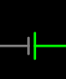
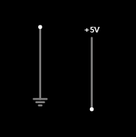
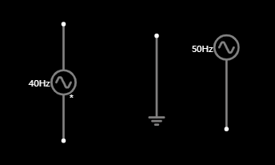
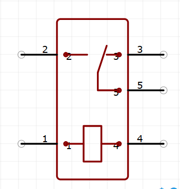

## 电路

### 电压

物理符号: U

单位: V(伏/伏特)

1kV = 1000V

1V = 1000mV(毫伏)

1mV = 1000uV(微伏)

串联电路中，每个用电**单位**的**电压和** == **电路**的**总电压**

并连电路中，支路电压和主路电压一样

### 电流

物理符号: I

单位: A(安培)

1秒内有6.2415093x10^18 次方个元电荷通过横切面的电流就是1A

1kA=1000A  1千安 = 1000 安

1A=1000mA 	1安 = 1000毫安

1mA=1000μA	1毫安 = 1000微安

### 电阻

物理符号: R

单位 Ω(欧/欧姆)

1000Ω = 1KΩ

1000KΩ = 1MΩ

金属丝的电阻与 材料、横截面积、长度有关 ，横切面积越小，长度越长电阻越大

### 串联

串连分压

电流从正极流向负极，中间没有分叉

### 并联

并联分流

电流从正极流向负极，中间会有分叉

### 欧姆定律

电流(I) = 电压(U) / 电阻(R)

电压 = 电流 * 电阻

电阻 = 电压 / 电流

### 电池容量计算

#### 安时容量

1AH  1A 的电流可以放电一小时

电池电压 * 安时 = 瓦时

#### 瓦时容量

1WH	1W的功率可以放电一小时

1000WH 	等于一度电

### 短路

短路: 一个导线直接连向了用电器的两端

电压表电阻很大可以看作断路

电流表电阻很小可以看作导线

### 直流与交流

#### 直流

##### 说明

电流方向不变，电荷始终朝一个方向流动

##### 直流电源符号

正极是长线，负极是短线

#### 交流

##### 说明

交流电的电流方向随时间变化

电压随时间周期而变化

##### 交流电源符号

 

### 开路和闭路

开路：线路为断开

闭路：线路闭合，为工作状态

### 根据数据手册计算电阻值

#### 计算方式

1. 获取用电器需要的电压和电流
2. 供电电压 - 用电器电压，得到需要剩余电压
3. 剩余电压 / 用电器电流，得到需要串联的电阻

#### 示例

1. 供电电压2v，供电电流20ma
2. 供电电压9v，9v - 2v = 7v，得到需要剩余电压
3. 7v / 20ma = 7000mv / 20ma = 350欧姆

## 元器件

### 电阻 

1. 封装
   - 贴片
   - 直插
   - 大小尺寸
2. 标称
   - 电阻的阻值
   - 电阻的精度差多少
3. 额定功率(可以承受的电流)
   - P = I * I * R = I * U
   - 获取电阻的功率(w 为单位)
   - 获取电阻的阻值
   - 功率除以电阻，结果在点根号2，得到电阻可以通过的电流

### 电容

#### 说明

储存电

有长短脚的电容分正负极,比如铝电解电容

#### 单位: F(法拉)

1F = 1000mF(毫法)

1mF = 1000uF(微法)

1uF = 1000nF(纳法)

1nF = 1000pF(皮法)

#### 放电时间

放电时间 = (电容容量 * 电容电压) / 放电电流

t = (F * V) / I

### 电感

#### 说明

电感,通常是一个线圈缠绕而成，内部一般有一个铁芯。

电流通过电感时,会在线圈中产生一个磁场，从而存储能量，当电流停止流动时，磁场崩溃，导致电感释放能量。

电感器可以调节电路中电流的变化率。过滤电路中的高频噪音，电感两端的电流不会突变，保护元器件不受到电磁干扰影响。

#### 单位: H(亨利)

1H = 1000mH(毫亨)

1mH = 1000uH(微亨)

1uH = 1000nH(纳亨)

### 保险丝，熔断器

电流过载时，断开电路。

### 蜂鸣器

#### 有源蜂鸣器

内置震动源，通电即有声音，声音单调

#### 无源蜂鸣器

没有震动源，通过代码发出不同的信号，发出不同声音，可以唱歌

### 继电器

有5个引脚。

其中1和4为控制引脚，

1和4不通电时，3和5导通。

通电时产生磁性，吸合导线，2和5导通。

1 和 4 供电电压为继电器上标注的，一般为5v，12v等。

### 二级管

电流单向导通，无法逆流

‘

### 三极管

~~~shell
# NPN三极管 高电平 导通 # (基极供电) 
# 导通时需要控制基极电流大小
# 电流过大烧毁三极管，以及浪费电
# 电流过小无法加入完全导通状态,此时三极管会分走一部分电压。导致三极管烧毁以及负载无法工作
	导通电流 >= 负载电流 / 放大倍率 # 完全导通
# 串联一个电阻控制基极电流
	电阻 = 基极电压 / 导通电流 
	实际接的电阻 <= 电阻 
	
	
# vbe(基极到发射极的压降) 0.7V
# 三极管放大倍率	100
# 电源电压	
# 负载电压

~~~

## PCB
